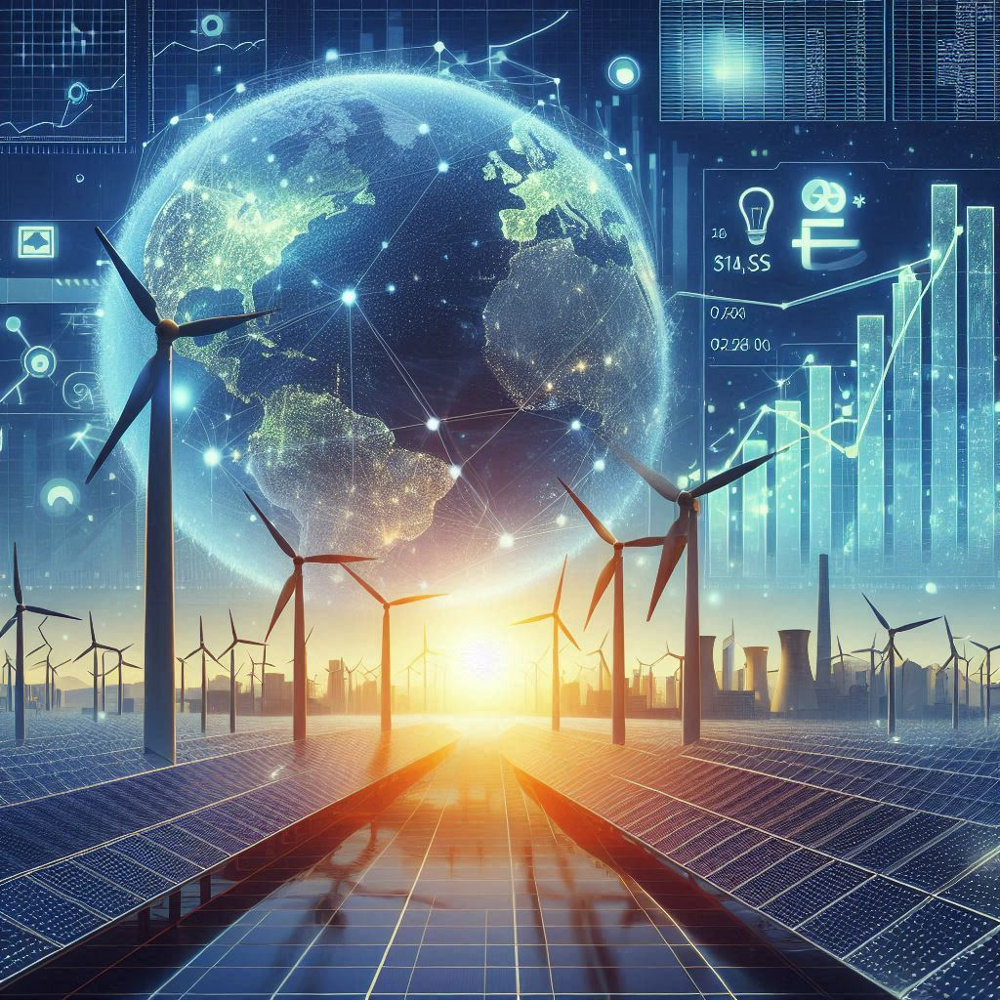

# About DEEP Policy Lab

Deep analysis, deep insights, for deep decarbonization

The **Deep Energy and Climate Policy Lab** (DEEP Policy Lab), founded by [Dr. Gang He](https://drganghe.github.io)’s team at Baruch College, City University of New York, aims to provide deep analysis and deep insights for deep decarbonization to address grand climate challenges.

The “DEEP” in DEEP Policy Lab stands for **D**ata-driven, **E**vidence-based, **E**nergy and climate **P**olicy, reflecting our commitment to robust analysis and research that empowers informed energy decisions and climate actions.

Our mission is to advance effective energy and climate solutions through rigorous, data-driven analysis and collaborative dialogue.

At DEEP Policy Lab, we leverage energy systems modeling, techno-economic analysis, big data, AI, and social sciences to shape policies on renewable energy, clean energy supply chains, deep decarbonization, and other key areas critical to the energy transition and achieving carbon neutrality.

We actively collaborate with academic institutions, government agencies, industry partners, and civil society organizations to foster innovation and impact in energy and climate policy.

Contact: Dr. Gang He: <gang.he@baruch.cuny.edu>

Created using Copilot
