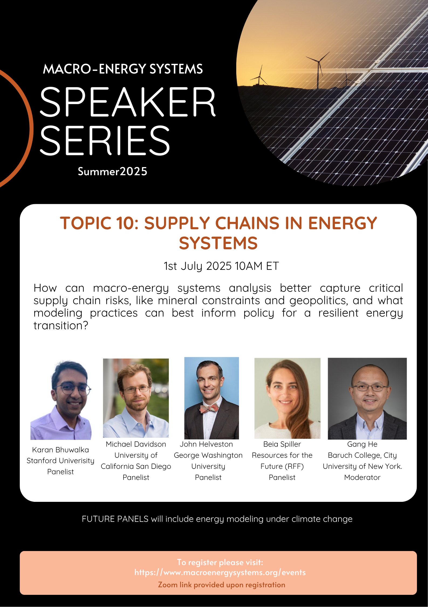

# Macro-Energy Systems Speaker Series: Supply Chains in Energy Systems

supply-chain

Join us to discuss how macro-energy systems analysis can better capture critical supply chain risks.

Author

Macro-Energy Systems

Published

July 1, 2025

Flyer Credit: Designed by Haochi Wu

## Title

Macro-Energy Systems Speaker Series: Supply Chains in Energy Systems

### Time

July 1, 2025

10:00 AM - 11:00 AM ET

### Venue

Online via Zoom. Please register [here](https://umich.zoom.us/webinar/register/WN_xaD85ZZvTDSdMf_dWosjgw).

## About

This session will focus on “Supply Chains in Energy Systems.” We will explore how macro-energy systems analysis can better capture critical supply chain risks, such as mineral constraints and geopolitics, and what modeling practices can best inform policy for a resilient energy transition.

## Moderator

##### Gang HE

Assistant Professor, CUNY Baruch College

## Panelists

##### Karan BHUWALKA

Research Scientist, Stanford University

##### Michael DAVIDSON

Assistant Professor, University of California, San Diego

##### John HELVESTON

Assistant Professor, George Washington University

##### Beia SPILLER

Fellow; Director, Transportation Program, Resources for the Future (RFF)

## Acknowledgment

This program is part of the [Macro-Energy Systems Speaker Series](https://www.macroenergysystems.org/events). We thank the Macro Energy Systems Steering Committee for sponsoring this event.

Flyer designed and organization facilitated by Haochi Wu.
