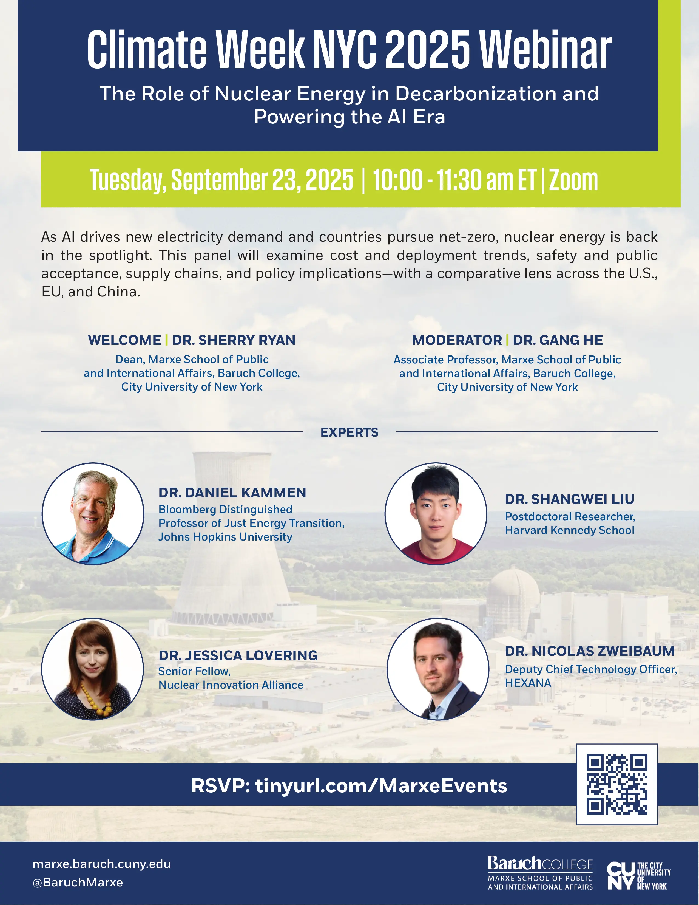

# Climate Week NYC 2025: The Role of Nuclear Energy in Decarbonization and Powering the AI Era

supply-chain

power-system

nuclear

Join us to discuss the role of nuclear energy in decarbonization and powering the AI era during Climate Week NYC 2025.

Author

Marxe School

Published

September 23, 2025

Flyer Credit: Marxe School Staff

## Title

The Role of Nuclear Energy in Decarbonization and Powering the AI Era

### Time

September 23, 2025

10:00AM - 11:30AM ET

### Venue

Online via Zoom. Please register [here](https://baruch.zoom.us/webinar/register/WN_iEpHmVc1Q2Cg6Iz1kLgDLw?_ics=1755893105800&irclickid=~2YPKMSVMUJOMNEIAyzFLCsulprvwsqnqsrxopfgc64ZOFyxvpkh~&_gl=1*o27pme*_gcl_au*Nzc0NjQzNDExLjE3NTU1NDU2NzE.*_ga*MzIyMjAzNjc2LjE3MDQzMTQ2NTY.*_ga_L8TBF28DDX*czE3NTU4OTE2OTIkbzk4JGcxJHQxNzU1ODkzMTA1JGozNCRsMCRoMA..#/registration).

## About

As nations target to meet net-zero goals, nuclear energy is reemerging as an essential — and often controversial — part of the clean energy mix. At the same time, the rapid rise of artificial intelligence is reshaping electricity demand, pushing policymakers and investors to consider large-scale, reliable, and low-carbon generation sources. This panel brings together global experts to discuss the role of nuclear power in deep decarbonization and its potential to meet the surging energy needs of the AI era. We will examine technological, economic, policy, and geopolitical factors influencing nuclear power’s future — with perspectives from China, the United States, and the European Union.

## Welcome

##### Sherry RYAN

Dean and Professor, Marxe School of Public and International Affairs, CUNY Baruch College

## Moderator

##### Gang HE

Associate Professor, CUNY Baruch College

## Remarks

##### Daniel M. KAMMEN

Bloomberg Distinguished Professor of Just Energy Transition, Johns Hopkins University

## Panelists

##### Shangwei LIU

Postdoctoral Researcher, Harvard University

##### Jessica LOVERING

Senior Fellow, Nuclear Innovation Alliance

##### Nicolas ZWEIBAUM

Deputy Chief Technology Officer, HEXANA

## Video

# An error occurred.

Unable to execute JavaScript.

## References

- Liu, Shangwei, Gang He, Minghao Qiu, and Daniel M. Kammen. 2025. “Can China Break the ‘Cost Curse’ of Nuclear Power?” *Nature* 643, 1186–88. <https://doi.org/10.1038/d41586-025-02341-z>
- Lovering, Jessica R., Arthur Yip, and Ted Nordhaus. 2016. “Historical Construction Costs of Global Nuclear Power Reactors.” *Energy Policy* 91: 371–82. <https://doi.org/10.1016/j.enpol.2016.01.011>.
- Hultman, Nathan E., Jonathan G. Koomey, and Daniel M. Kammen. 2007. “What History Can Teach Us About the Future Costs of U.S. Nuclear Power.” *Environmental Science & Technology* 41 (7): 2087–94. <https://doi.org/10.1021/es0725089>.

## Links

- Marxe School Event Page: [Climate Week NYC 2025 Webinar](https://marxe.baruch.cuny.edu/nyc-climate-week-webinar/)
- Official Climate Week NYC 2025 Event Page: [The Role of Nuclear Energy in Decarbonization and Powering the AI Era](https://www.climateweeknyc.org/event-search/role-nuclear-energy-decarbonization-and-powering-ai-era), [Archive](official-listing.png)

## Acknowledgment

This program is sponsored by the [Marxe School of Public and International Affairs](https://marxe.baruch.cuny.edu/).

We thank Diana Lazov, Amanda Puk, and Zoe Crook for their help with the event.
