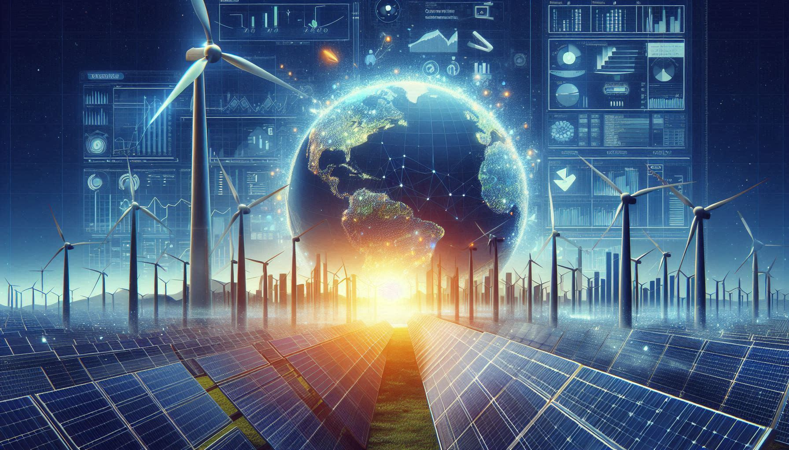
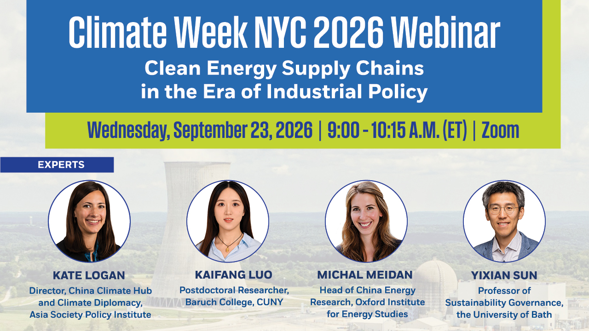
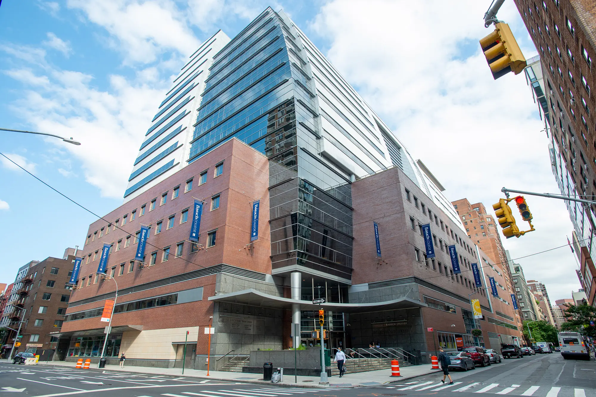
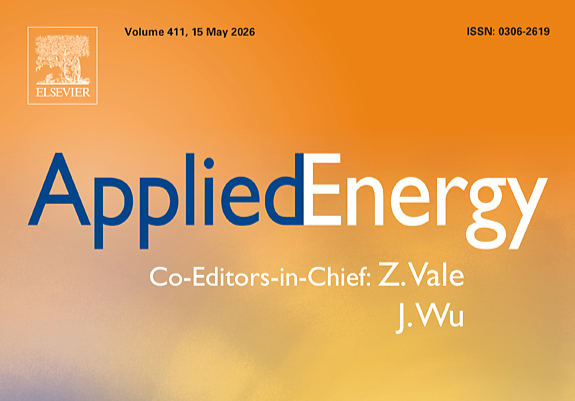

Welcome to Deep Energy and Climate Policy Lab

Data-driven, Evidence-based, Energy and Climate Solutions

Deep analysis, Deep insights, for Deep decarbonization

[Learn more](about.llms.md)

What’s new

##### Climate Week NYC 2026: Clean Energy Supply Chains in the Era of Industrial Policy

Sep 23, 2026

##### Baruch Professor Gang He Receives CUNY Research Award

Jul 2, 2026

##### New Grant to Study the Drivers and Impacts of Domestic Clean Energy Manufacturing

Dec 17, 2025

[More News](more-news.llms.md)

[More Events](more-events.llms.md)

What we do

##### Clean Energy Supply Chains

##### Power Systems Decarbonization

##### Climate Impacts on Energy Systems

##### Energy Nexus Research

##### Energy and Climate Justice

##### China Carbon Neutrality Initiative

##### New York Climate Initiative

##### United States Clean Energy Initiative

[Explore more](research.llms.md)

Read our work

##### Resilience planning for power systems under deep climate uncertainty

*Energy Economics*

Sep 1, 2026

##### Aligning offshore wind deployment with local priorities to accelerate power system decarbonization

*Communications Earth & Environment*

Apr 21, 2026

##### Emission trading scheme reshapes the decarbonisation pathways of China’s power sector

*Applied Energy*

Mar 21, 2026

[Read more](more-publications.llms.md)
