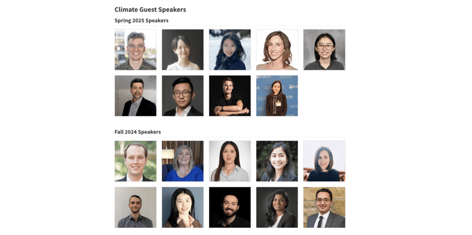
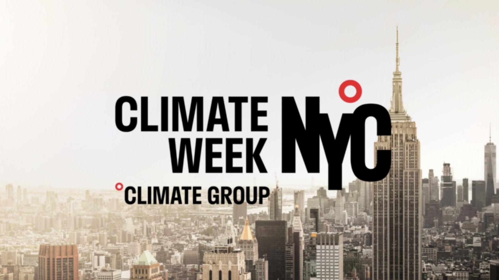
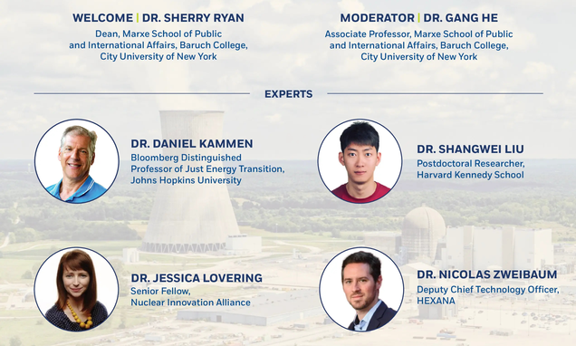
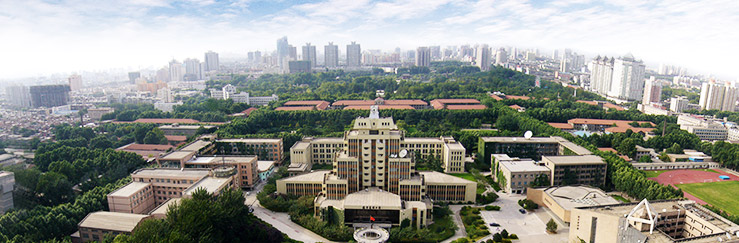
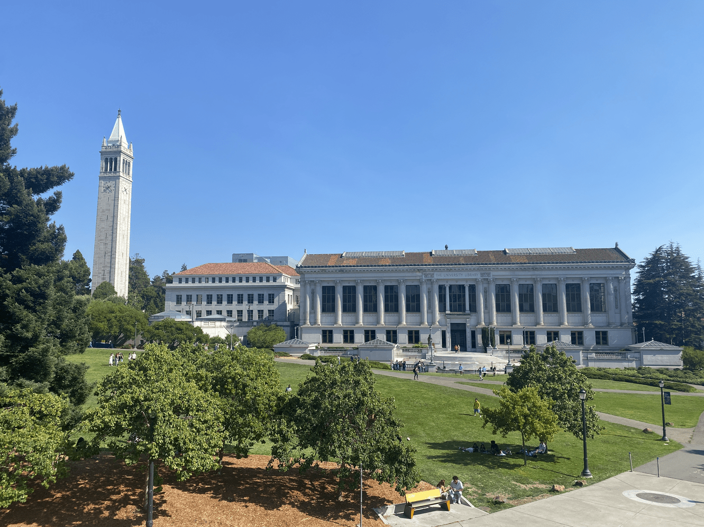

# Events

What’s happening

|  | Title | Date | Description |
|----|----|----|----|
|  | [Climate Guest Speakers Series](https://drganghe.github.io/climate-guest-speakers/speakers.html) |   | Join climate doers and thinkers from frontiers of science, policy, and markets to share their insights and experiences on climate change, ask questions, and learn how to make a difference. |
|  | [Climate Week NYC 2026: Clean Energy Supply Chains in the Era of Industrial Policy](events/2026-09-23-nyc-climate-week-clean-energy-supply-chains-in-the-era-of-industrial-policy-panel/index.llms.md) | 2026-09-23 | Join us to discuss Clean Energy Supply Chains in the Era of Industrial Policy during Climate Week NYC 2026. |
|  | [Climate Week NYC 2025: The Role of Nuclear Energy in Decarbonization and Powering the AI Era](events/2025-09-23-nyc-climate-week-nuclear-energy-panel/index.llms.md) | 2025-09-23 | Join us to discuss the role of nuclear energy in decarbonization and powering the AI era during Climate Week NYC 2025. |
|  | [Macro-Energy Systems Speaker Series: Supply Chains in Energy Systems](events/2025-07-01-mes-supply-chains-in-energy-systems-panel/index.llms.md) | 2025-07-01 | Join us to discuss how macro-energy systems analysis can better capture critical supply chain risks. |
|  | 2025 Workshop on Open Modeling Carbon Neutrality of the Power Sector | 2025-06-20 | The second workshop on open modeling carbon neutrality of the power sector is held at Xi’an Jiaotong University in China. |
|  | [Climate Week NYC 2024: Clean Energy Global Supply Chains Panel](events/2024-09-26-nyc-climate-week-clean-energy-global-supply-chains-panel/index.llms.md) | 2024-09-26 | Join us to discuss Role of Clean Energy Global Supply Chains in Achieving Climate Goals during Climate Week NYC 2024. |
|  | [ICAE 2024 Keynote: Cost Saving, Climate, and Health Effects of Solar PV Global Supply Chains](https://applied-energy.org/icae2024/#Program) | 2024-09-03 | Dr. Gang He is invited to give an online keynote speech in the International Conference on Applied Energy 2024. |
|  | [2024 Workshop on Open Modeling Carbon Neutrality of the Power Sector](events/2024-07-19-workshop-on-open-modeling-carbon-neutrality-of-the-power-sector/index.llms.md) | 2024-07-19 | Developing a community to enable open and safe modeling and data sharing |
