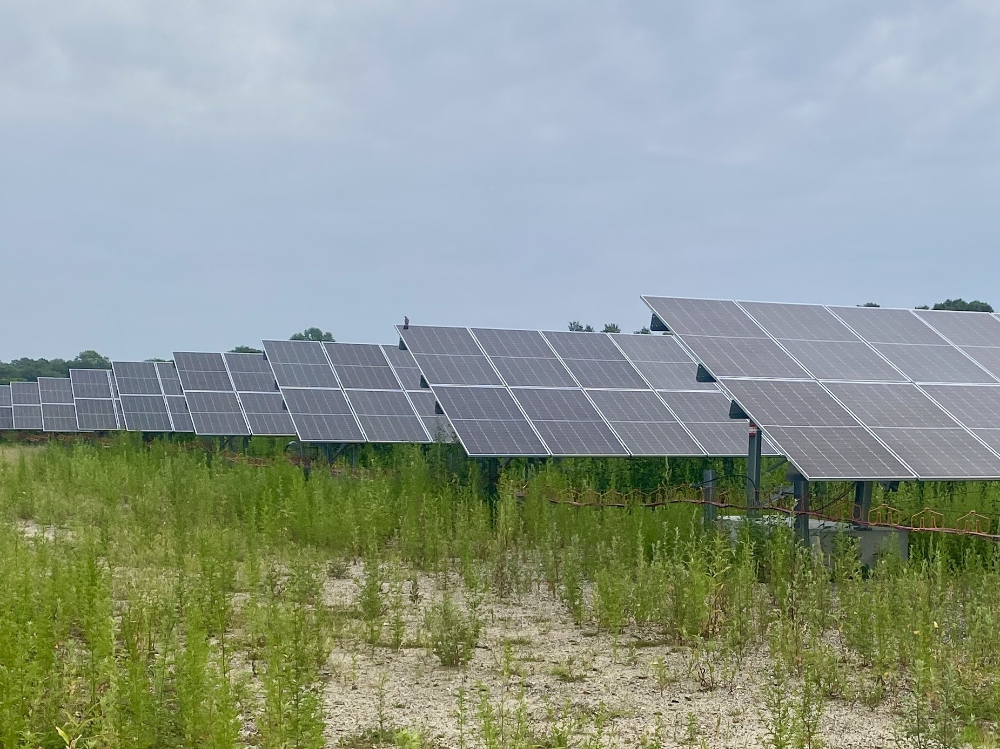
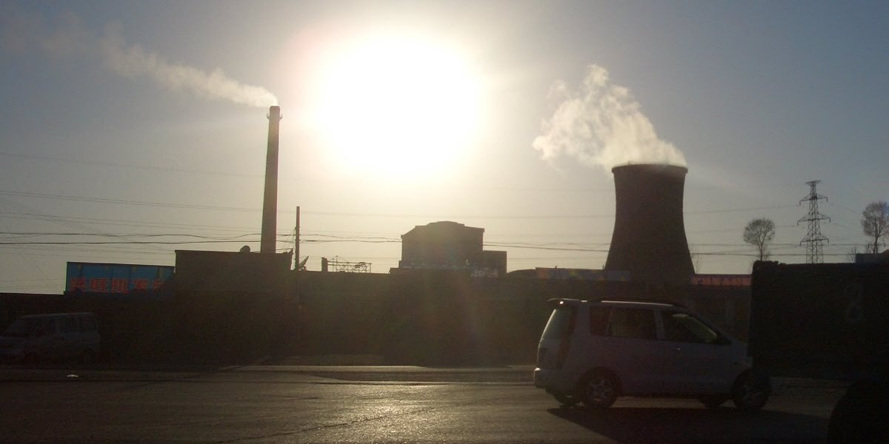
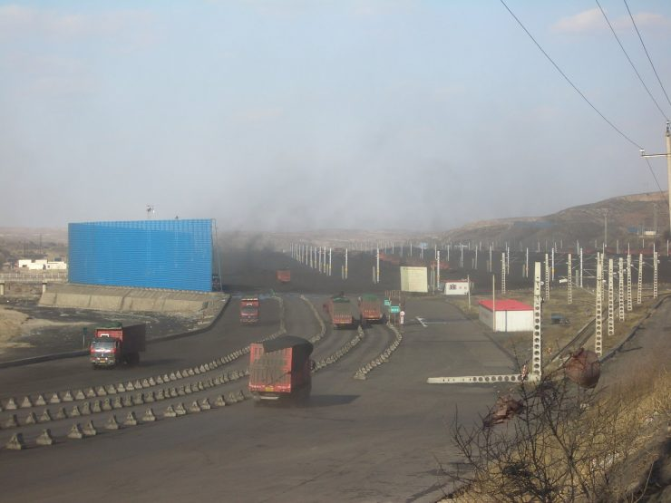
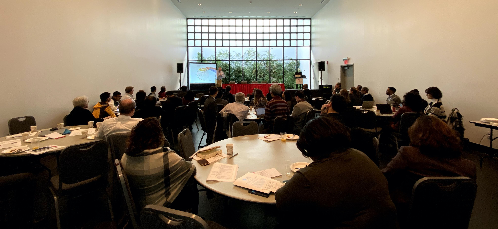

# News

What’s new

|  | Title | Date | Description |
|----|----|----|----|
|  | [Baruch Professor Gang He Receives CUNY Research Award](https://newscenter.baruch.cuny.edu/news/baruch-professor-gang-he-receives-cuny-research-award/) | 2026-07-02 | Gang He, PhD, won the 2026 Sandi Cooper Award presented by the CUNY Academy. |
|  | [New Grant to Study the Drivers and Impacts of Domestic Clean Energy Manufacturing](news/2025-12-17-sloan-grant-drivers-and-impacts-domestic-manufacturing.llms.md) | 2025-12-17 | Gang He, Kaifang Luo, Michael Davidson, Ahmad Lashkaripour, Ilaria Mazzocco, and Minghao Qiu are awarded a \$750,000 new Alfred P. Sloan Foundation grant to study the drivers and impacts of domestic clean manufacturing interventions, resulting from an Open Call on Energy System Interactions in the United States. |
|  | [New Study Finds Imported Solar Panels Deliver Major Climate and Health Benefits to the U.S.](news/2025-10-08-one-earth-imported-solar-pv-health-and-climate-benefits-in-the-united-states.llms.md) | 2025-10-08 | New study published in *One Earth* showing that imported solar panels prevented nearly 600 premature deaths and delivered \$28 billion in climate and health benefits to the United States. |
|  | [Nature Comment: Can China Break the ‘Cost Curse’ of Nuclear Power?](news/2025-07-28-nature-comment-nuclear-costs.llms.md) | 2025-07-28 | Comment published in *Nature* shows escalating construction expenses threaten to derail global progress on atomic energy. China offers lessons on how to rein in costs. |
|  | [New Study Shows Fewer Than 15% of China’s Coal Power Plant Workers Can Easily Transition to Green Jobs by 2060](news/2024-11-06-one-earth-coal-jobs-transition.llms.md) | 2024-11-06 | Study published in *One Earth* shows that fewer than 15% of China’s coal power plant workforce will find it easy to shift into green jobs; a coal power worker needs to travel 194 (178–242) km on average to access a green job. |
|  | [New Grant: Exploring Energy Burden Among the Older Adults and People with Disabilities in New York City Public Housing Communities](https://deeppolicylab.github.io/projects/2024-ssa-energy-burden-older-adults-people-with-disabilities-nyc.html) | 2024-11-01 | Gang He, Kaifang Luo, Hilary Botein, and Frank Heiland were awarded a SSA grant |
|  | [Baruch College Faculty Included in World’s Top Scientist List](https://newscenter.baruch.cuny.edu/news/baruch-college-faculty-included-in-worlds-top-scientist-list/) | 2024-10-22 | Dr. Gang He is included in Stanford University and Elsevier’s “World’s Top 2% Scientists” list for 2024 |
|  | [Taking a Global Look at Dry and Alternative Water Cooling of Power Plants](https://news.stonybrook.edu/newsroom/taking-a-global-look-at-dry-and-alternative-water-cooling-of-power-plants/) | 2023-08-09 | Study published in *Nature Water* suggests integrating planning may reduce carbon emissions in the future |
|  | [Global Collaboration is Key to Saving Billions for Solar Module Production](https://news.stonybrook.edu/newsroom/global-collaboration-is-key-to-saving-billions-for-solar-module-production/) | 2022-10-26 | Study published in *Nature* quantifies for the first time past and future country cost savings to the solar industry from globalized supply chains. |
|  | [Energy Transition Away from Coal in China Will Yield Benefits](https://news.stonybrook.edu/newsroom/energy-transition-away-from-coal-in-china-will-yield-benefits/) | 2020-08-21 | In a perspective paper published in *One Earth*, an international scientific team contends that China needs to transition away from coal to help the world achieve global decarbonization and improve the nation’s environmental and human health. |
|  | [Study Shows Decrease in Renewable Energy Costs May Serve as an Accelerator for Clean Energy Expansion](https://news.stonybrook.edu/newsroom/study-shows-decrease-in-renewable-energy-costs-may-serve-as-an-accelerator-for-clean-energy-expansion/) | 2020-06-01 | The study reveals fast decarbonization is both technically feasible and economically beneficial, which offers the prospect of large emissions mitigation with a global environmental impact. |
|  | [NSF Wokshop on Data Science Across the Undergraduate Curriculum](https://news.stonybrook.edu/homespotlight/stony-brook-university-hosts-nsf-funded-data-science-workshop/) | 2020-01-19 | On January 9-10, 2020, we hosted the NSF funded workshop entitled “Data Science Across the Undergraduate Curriculum: University-Industry Online Case Studies on Applications of Data Science.” |
