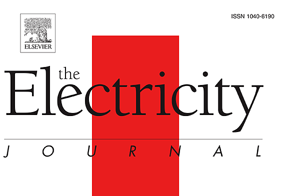
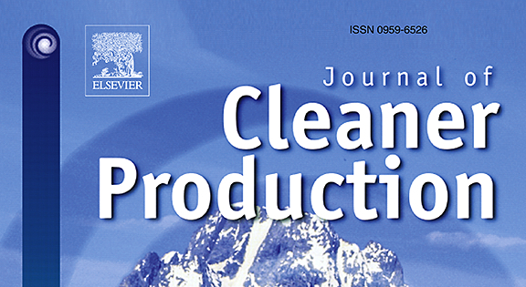
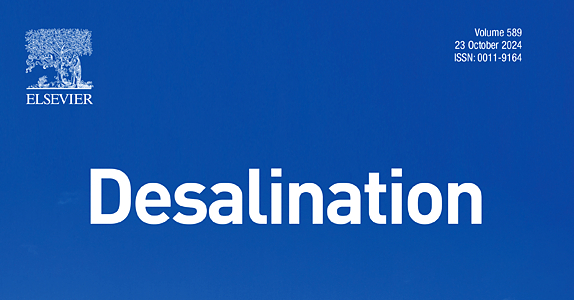
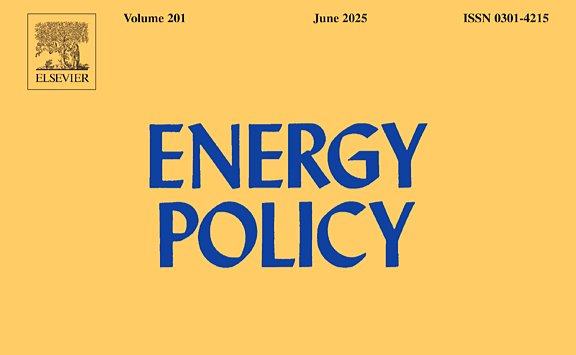

# More Publications

Read more about our papers and articles

|  | Title | Journal | Year | Summary | Fulltext |
|----|----|----|----|----|----|
|  | [Resilience planning for power systems under deep climate uncertainty](https://doi.org/10.1016/j.eneco.2026.109527) | *Energy Economics* | 2026 | A hybrid framework combining a Graph Neural Network and a Conditional Generative Adversarial Network (GNN-cGAN) is utilized to capture the spatiotemporal couplings of multiple meteorological variables, which provides a more realistic characterization of deep climate uncertainties and compound extreme events. | [pdf](https://www.sciencedirect.com/science/article/pii/S0140988326004068) |
|  | [Aligning offshore wind deployment with local priorities to accelerate power system decarbonization](https://www.nature.com/articles/s43247-026-03533-9) | *Communications Earth & Environment* | 2026 | Offshore wind can bolster the energy self-sufficiency of coastal provinces, shifting them from net electricity importers to exporters. It also reduces the need for energy storage in a grid with high renewable penetration and drives substantial local investment and job creation. | [pdf](https://www.nature.com/articles/s43247-026-03533-9.pdf) |
|  | [Emission trading scheme reshapes the decarbonisation pathways of China’s power sector](https://doi.org/10.1016/j.apenergy.2026.127726) | *Applied Energy* | 2026 | Integrating the SWITCH-China capacity expansion model with a carbon trading module, we evaluate the potential carbon profits and costs of currently operating ETS-regulated units and enterprises from 2025 to 2050, and their impact on the decarbonisation pathways of China’s power system. | [pdf](https://authors.elsevier.com/c/1morx15eifJiHC) |
|  | [Coal Mine Workers in the Climate Transition: Subnational Vulnerability Disparities in China and India](https://iopscience.iop.org/article/10.1088/1748-9326/ae3fb3) | *Environmental Research Letters* | 2026 | Beyond national climate ambitions, differences in mining productivity, local economic diversification, labour concentration, and employment patterns drive subnational disparities in vulnerability to accelerated mitigation. | [pdf](https://iopscience.iop.org/article/10.1088/1748-9326/ae3fb3/pdf) |
|  | [Renewable integration and AI demand reshaped power grids in 2025](https://doi.org/10.1038/s44359-025-00136-z) | *Nature Reviews Clean Technology* | 2026 | The importance of renewable integration into grids came to the forefront in 2025. New challenges in stability, storage, artificial intelligence demand and policy changes defined a year that tested whether power systems can become reliable, flexible and equitable in a net-zero world. | [SharedIt](https://rdcu.be/eZUji) |
|  | [Imported solar photovoltaics contributed to health and climate benefits in the United States](https://doi.org/10.1016/j.oneear.2025.101467) | *One Earth* | 2025 | Imported solar panels prevented nearly 600 premature deaths and delivered \$28 billion in climate and health benefits to the United States. | [preprint](https://drganghe.github.io/files/papers/2025-one-earth-health-climate-benefits-of-imported-solar-pv-in-the-united-states.pdf) |
|  | [Can China break the ‘cost curse’ of nuclear power?](https://doi.org/10.1038/d41586-025-02341-z) | *Nature* | 2025 | Strengthening regulations and domestic supply chains could be key to making nuclear power more economically viable. | [SharedIt](https://rdcu.be/eyaXW) |
|  | [Role of pumped hydro storage in China’s power system decarbonization](https://doi.org/10.1016/j.tej.2025.107487) | *The Electricity Journal* | 2025 | Our findings indicate that building excessive PHS may not be the most cost-effective path to achieve zero-carbon power system, if there is no major cost reduction of PHS. | [pdf](https://www.sciencedirect.com/science/article/pii/S1040619025000326/pdfft?md5=b4d917468b239ff9496538b66df8c1f5&pid=1-s2.0-S1040619025000326-main.pdf) |
|  | [Cost-effectiveness of removing the last 10-20% emissions of China’s power sector](https://iopscience.iop.org/article/10.1088/1748-9326/adc0b3) | *Environmental Research Letters* | 2025 | Eliminating the last 10–20% of CO2 emissions creates net climate and health benefits with only slightly increased costs. | [pdf](https://iopscience.iop.org/article/10.1088/1748-9326/adc0b3/pdf) |
|  | [Fewer than 15% of coal power plant workers in China can easily shift to green jobs by 2060](https://doi.org/10.1016/j.oneear.2024.10.006) | *One Earth* | 2024 | A coal power worker needs to travel 194 (178–242) km on average to access a green job. Only 11%–14% of existing coal power workers will transition to green jobs by 2060. | [pdf](https://www.cell.com/action/showPdf?pii=S2590-3322%2824%2900530-X) |
|  | [Regional disparities in health and employment outcomes of China’s transition to a low-carbon electricity system](https://iopscience.iop.org/article/10.1088/2753-3751/ad3bb8) | *Environmental Research: Energy* | 2024 | Although disparities in health impacts across provinces narrow as fossil fuels phase out, disparities in labor compensation widen with wealthier East Coast provinces gaining the most in labor compensation. | [pdf](https://iopscience.iop.org/article/10.1088/2753-3751/ad3bb8/pdf) |
|  | [Advancing a just, resilient, and sustainable clean energy supply chain](https://www.climateworks.org/blog/advancing-a-just-resilient-and-sustainable-clean-energy-supply-chain/) | *ClimateWorks Blog* | 2023 | In addressing the challenges and maximizing the benefits, there is a pressing need for a commonly agreed framework for a just, resilient, and sustainable clean energy supply chain. | [link](https://drganghe.github.io/posts/2023-12-just-resilient-sustainable-clean-energy-supply-chains/index.html) |
|  | [Deploying solar photovoltaic energy first in carbon-intensive regions brings gigatons more carbon mitigations to 2060](https://www.nature.com/articles/s43247-023-01006-x) | *Communications Earth & Environment* | 2023 | A net GHG mitigation of 1.29 Gt CO2-equivalent from 2009–2019, achieved by 1.97 Gt of mitigation from installation minus 0.68 Gt of emissions from manufacturing. | [pdf](https://www.nature.com/articles/s43247-023-01006-x.pdf) |
|  | [Accelerating China’s power sector decarbonization can save lives: integrating public health goals into power sector planning decisions](https://iopscience.iop.org/article/10.1088/1748-9326/acf84b) | *Environmental Research Letters* | 2023 | The value of climate and health benefits would exceed the additional costs, leading to \$824 billion net benefits from 2021 to 2050. | [pdf](https://iopscience.iop.org/article/10.1088/1748-9326/acf84b/pdf) |
|  | [Heterogeneous effects of battery storage deployment strategies on decarbonization of provincial power systems in China](https://www.nature.com/articles/s41467-023-40337-3) | *Nature Communications* | 2023 | We find heterogeneous strategy provides the lowest system costs, however, carbon emissions depend on carbon prices. | [pdf](https://www.nature.com/articles/s41467-023-40337-3.pdf) |
|  | [Global assessment of the carbon–water tradeoff of dry cooling for thermal power generation](https://www.nature.com/articles/s44221-023-00120-6) | *Nature Water* | 2023 | We build a global unit-level framework to investigate the CO2 emission and energy penalty due to the deployment of dry cooling. | [SharedIt](https://rdcu.be/diKmv) |
|  | [Climate change impacts on planned supply–demand match in global wind and solar energy systems](https://www.nature.com/articles/s41560-023-01304-w) | *Nature Energy* | 2023 | Up to 32% or 44% of non-Antarctic land areas for wind or solar, respectively, are projected to experience supply demand match reductions by the end of this century under an intermediate emission scenario. | [pdf](https://www.nature.com/articles/s41560-023-01304-w.pdf) |
|  | [Quantifying the cost savings of global solar photovoltaic supply chains](https://www.nature.com/articles/s41586-022-05316-6) | *Nature* | 2022 | Globalized supply chain has saved solar installers in the U.S., Germany, and China \$67B 2008-2020, and solar prices will be 20-30% higher in 2030 if countries move to produce domestically. | [SharedIt](https://rdcu.be/enuBz) |
|  | [Modeling Integrated Power and Transportation Systems: Impacts of Power-to-Gas on the Deep Decarbonization](https://doi.org/10.1109/TIA.2021.3116916) | *IEEE Transactions on Industry Applications* | 2022 | Hydrogen could link power and transport systems and reduce costs of deep decarbonization for both sectors. | [pdf](https://drganghe.github.io/files/papers/2022-IEEE-ModelingIntegratedPowerAndTransportationSystems.pdf) |
|  | [Challenges and opportunities for carbon neutrality in China](https://www.nature.com/articles/s43017-021-00244-x) | *Nature Reviews Earth & Environment* | 2022 | In this Perspective, we summarize the key features of China’s CO₂ emissions, its reduction processes and successes in meeting climate targets. | [SharedIt](https://rdcu.be/enuBK) |
|  | [Large balancing areas and dispersed renewable investment enhance grid flexibility in a renewable-dominant power system in China](https://doi.org/10.1016/j.isci.2022.103749) | *iScience* | 2022 | Regional balancing could reduce the renewable curtailment rate by 5–7%, compared with a provincial balancing strategy. | [pdf](https://www.cell.com/action/showPdf?pii=S2589-0042%2822%2900019-0) |
|  | [Long-term transition of China’s power sector under carbon neutrality target and water withdrawal constraint](https://doi.org/10.1016/j.jclepro.2021.129765) | *Journal of Cleaner Production* | 2021 | Low cost renewables reduced the need for CCS by 80%, and water constraints nearly squeeze CCS out. | [pdf](https://drganghe.github.io/files/papers/2021-JCP-ChinaPowerCarbonWaterNexus.pdf) |
|  | [Enabling a Rapid and Just Transition away from Coal in China](https://doi.org/10.1016/j.oneear.2020.07.012) | *One Earth* | 2020 | An aggressive coal-transition pathway is needed to achieve the carbon neutrality goal while saving water and avoiding premature deaths. | [pdf](https://www.cell.com/action/showPdf?pii=S2590-3322%2820%2930356-0) |
|  | [Rapid cost decrease of renewables and storage accelerates the decarbonization of China’s power system](https://www.nature.com/articles/s41467-020-16184-x) | *Nature Communications* | 2020 | A renewable-dominant pathway is not just technologically sound, but also cost-effective. | [pdf](https://www.nature.com/articles/s41467-020-16184-x.pdf) |
|  | [Experiences and lessons from China’s success in providing electricity for all](https://doi.org/10.1016/j.resconrec.2017.03.011) | *Resources, Conservation and Recycling* | 2017 | Key experiences and lessons to be learned from China’s successful program to provide electricity for all. | [pdf](https://drganghe.github.io/files/papers/2017-china-electricity-for-all.pdf) |
|  | [SWITCH-China: A Systems Approach to Decarbonizing China’s Power System](https://pubs.acs.org/doi/10.1021/acs.est.6b01345) | *Environmental Science & Technology* | 2016 | SWITCH-China, an integrated model for power sector decarbonization. | [pdf](https://drganghe.github.io/files/papers/2016-EST-SWITCH-China.pdf) |
|  | [Where, when and how much solar is available? A provincial-scale solar resource assessment for China](https://doi.org/10.1016/j.renene.2015.06.027) | *Renewable Energy* | 2016 | We utilized 10-year hourly solar irradiation data from 2001 to 2010 from 200 representative locations to develop provincial solar availability profiles. | [pdf](https://drganghe.github.io/files/papers/2016-RE-ChinaProvincialSolar.pdf) |
|  | [Assessing the impacts of nuclear desalination and geoengineering to address China’s water shortages](https://www.sciencedirect.com/science/article/abs/pii/S0011916414006754) | *Desalination* | 2015 | We compare both coal and nuclear desalination with the currently planned South–North Water Transfer Mega-Project and show that, while the short-run cost of water diversion is lower, critical vulnerabilities and future resource demands favor nuclear desalination. | [pdf](https://drganghe.github.io/files/papers/2015-DESAL-Nuclear-desalination-and-water-shortages-in-China.pdf) |
|  | [ELITE cities: A low-carbon eco-city evaluation tool for China](https://doi.org/10.1016/j.ecolind.2014.09.018) | *Ecological Indicators* | 2015 | ELITE Cities is an Excel-based tool that measures city low-carbon development progress on 33 key indicators. | [pdf](https://drganghe.github.io/files/papers/2015-EI-ELITE-Cities.pdf) |
|  | [Where, When and How Much Wind Is Available? A Provincial-Scale Wind Resource Assessment for China](https://doi.org/10.1016/j.enpol.2014.07.003) | *Energy Policy* | 2014 | We utilized 200 representative locations for which 10 years of hourly wind speed data exist to develop provincial capacity factors from 2001 to 2010, and to build analytic wind speed profiles. | [pdf](https://drganghe.github.io/files/papers/2014-EP-ChinaProvincialWind.pdf) |
|  | [Addressing carbon Offsetters’ Paradox: Lessons from Chinese wind CDM](https://doi.org/10.1016/j.enpol.2013.09.021) | *Energy Policy* | 2013 | The paper examines the application of additionality in the Chinese wind power market and draws implications for the design of effective global carbon offset policy. | [pdf](https://drganghe.github.io/files/papers/2013-EP-ChinaWindCDM.pdf) |
