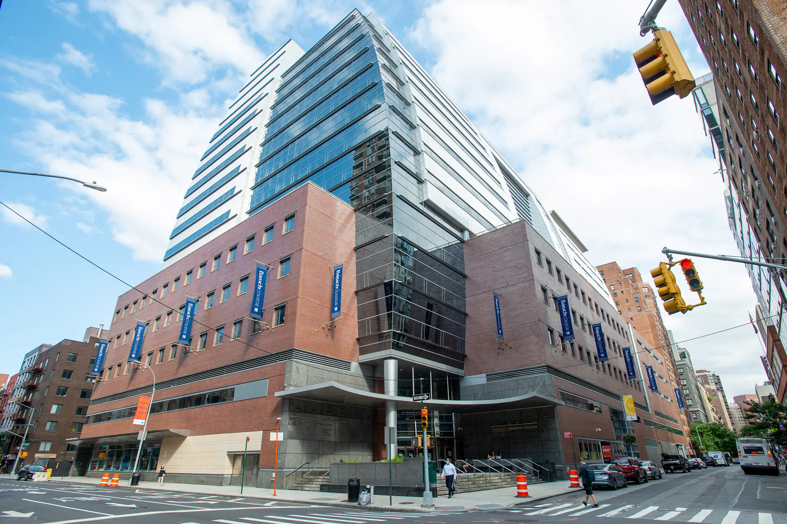
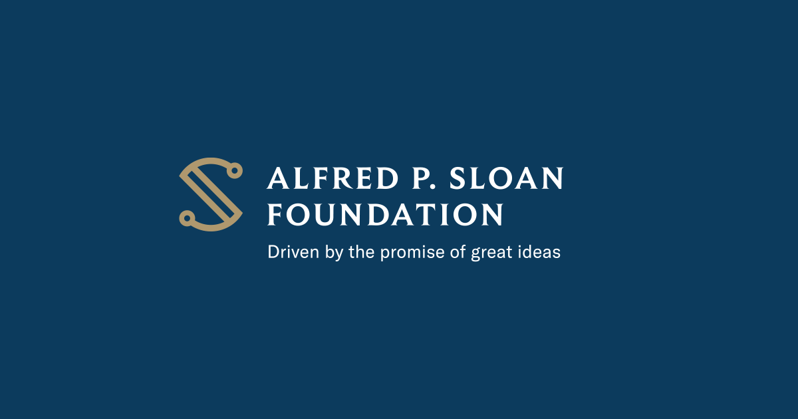
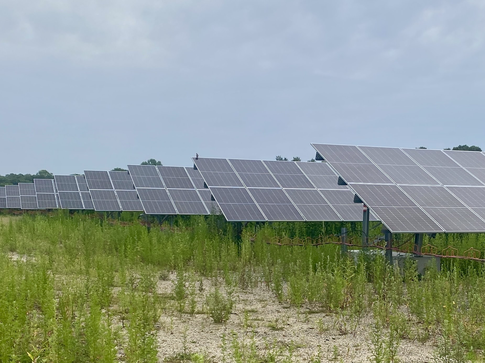
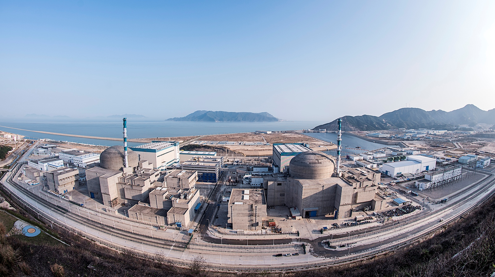
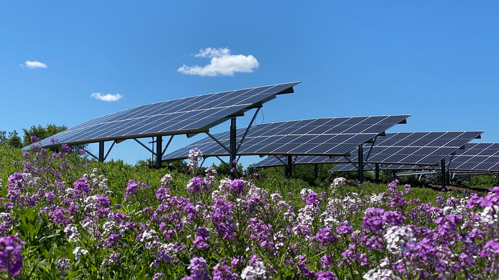

# News

Featured releases

##### Baruch Professor Gang He Receives CUNY Research Award

Gang He, PhD, won the 2026 Sandi Cooper Award presented by the CUNY Academy.

Jul 2, 2026

##### New Grant to Study the Drivers and Impacts of Domestic Clean Energy Manufacturing

Gang He, Kaifang Luo, Michael Davidson, Ahmad Lashkaripour, Ilaria Mazzocco, and Minghao Qiu are awarded a \$750,000 new Alfred P. Sloan Foundation grant to study the drivers…

Dec 17, 2025

##### New Study Finds Imported Solar Panels Deliver Major Climate and Health Benefits to the U.S.

New study published in *One Earth* showing that imported solar panels prevented nearly 600 premature deaths and delivered \$28 billion in climate and health benefits to the…

Oct 8, 2025

##### Nature Comment: Can China Break the ‘Cost Curse’ of Nuclear Power?

Comment published in *Nature* shows escalating construction expenses threaten to derail global progress on atomic energy. China offers lessons on how to rein in costs.

Jul 28, 2025

##### Baruch College Faculty Included in World’s Top Scientist List

Dr. Gang He is included in Stanford University and Elsevier’s “World’s Top 2% Scientists” list for 2024.

Oct 22, 2024

##### Global Collaboration is Key to Saving Billions for Solar Module Production

Study published in *Nature* quantifies for the first time past and future country cost savings to the solar industry from globalized supply chains.

Oct 26, 2022

[More Releases »](more-news.llms.md)
