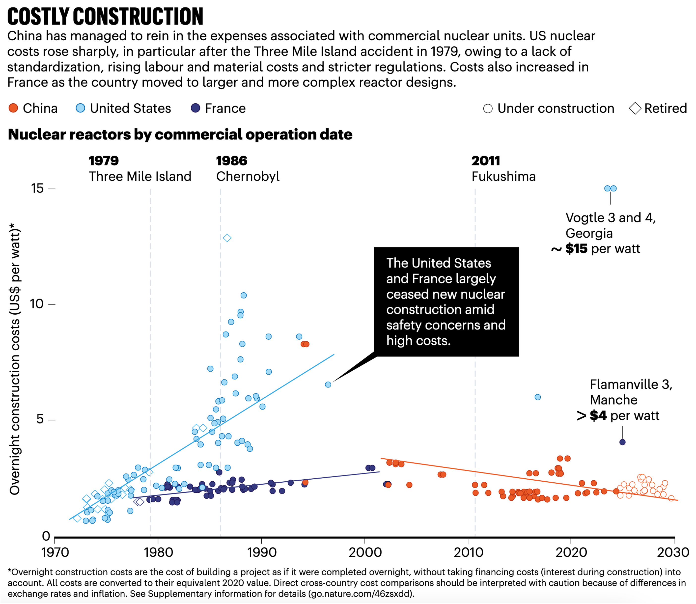

# Nature Comment: Can China Break the ‘Cost Curse’ of Nuclear Power?

Comment published in *Nature* shows escalating construction expenses threaten to derail global progress on atomic energy. China offers lessons on how to rein in costs.

Published

July 28, 2025

Publication: *Nature*  
Date: July 28, 2025  
Links: Published [paper](https://www.nature.com/articles/d41586-025-02341-z); SharedIt [fulltext](https://rdcu.be/eyaXW); Preprint [pdf](https://drganghe.github.io/files/papers/2025-nature-nuclear-costs.pdf); Supplemental Information [pdf](https://media.nature.com/original/magazine-assets/d41586-025-02341-z/51274736); Source Data [csv](https://www.nature.com/magazine-assets/d41586-025-02341-z/51274734)

## Authors

##### Shangwei LIU

Postdoctoral Researcher, Harvard University

##### Gang HE

Associate Professor, CUNY Baruch College

##### Minghao QIU

Assistant Professor, Stony Brook University

##### Daniel M. KAMMEN

Bloomberg Distinguished Professor of Just Energy Transition, Johns Hopkins University

## Release

**Nuclear Renaissance? China’s Strategy Offers Lessons to Curb Soaring Construction Costs**

A new Nature Comment article shows how China’s energy policy and industrial approach have brought nuclear construction costs down, offering insights for the global clean energy transition.

July 28, 2025 — As countries race to scale up nuclear power to meet climate goals and power data centers, a longstanding problem persists: nuclear plants are notoriously expensive to build. But a new Comment article in *Nature* reveals that China is reversing this global trend—offering lessons for how to rein in costs.

In the article, researchers from Harvard, CUNY, Stony Brook, and Johns Hopkins analyze newly compiled, plant-level data to show how China has managed to reduce nuclear construction costs over time. The authors credit China’s approach to a combination of standardized designs, strategic indigenization of components, and coordinated industrial policy.

Chart shows that China has reined in the expenses associated with commercial nuclear units, while costs rose in the U.S. and France.[^1]

“Historically, in most countries, the more nuclear we build, the more expensive it gets, a phenomenon often called the nuclear cost curse,” said Shangwei Liu, lead author and researcher at the Belfer Center at Harvard Kennedy School. “China is the only country that has substantially expanded its nuclear fleet over the two past decades, but no comprehensive cost data was available. Here, we compile that data for the first time and find, somewhat surprisingly, that costs have been declining.”

The authors caution that nuclear power is still not “cheap,” but argue that China’s experience offers a valuable lessons for other countries aiming to deploy nuclear energy affordably and at scale. In particular, the article highlights the importance of coordinated regulation, staged indigenization of manufacturing, and long-term planning.

“Substituting expensive imports with domestically produced components substantially lowered costs,” said Gang He, assistant professor at the Marxe School of Public and International Affairs at CUNY Baruch College and Doctoral Faculty at the CUNY Graduate Center. “Strategic indigenization may be the key not only for nuclear, but also for other clean technologies in countries seeking to scale up rapidly.”

The authors also call on researchers, policymakers, and industry leaders to avoid repeating past mistakes—such as abandoning standardized designs or rushing to localize complex systems before domestic capabilities are ready. They argue for deeper component-level cost analysis and greater alignment between safety and cost control in regulatory systems.

“Countries that export nuclear technology should collaborate with importing ones,” said Minghao Qiu, assistant professor at Stony Brook University, “identify components that can be locally manufactured and train the workforce.”

As interest in small modular reactors (SMRs) grows and new nations enter the nuclear arena, the authors urge decision-makers to learn from both success stories and setbacks. “China shows that nuclear costs don’t have to rise with scale,” said Daniel Kammen, Bloomberg Distinguished Professor of Just Energy Transition at Johns Hopkins University. “But breaking the cost curse will take more than technology—it will take a smart and strategic approach.”

## Press Releases

##### Breaking the Cost Escalation Curse of Nuclear Power

Belfer Center for Science and International Affairs

##### China’s Nuclear Power Development Strategy Holds Key to Lower Costs

CUNY Graduate Center

##### Nuclear plants too expensive? China shows low-cost construction possible

Johns Hopkins University

**Citation**

- Liu, Shangwei, Gang He, Minghao Qiu, and Daniel Kammen. 2025. “Can China break the ‘cost curse’ of nuclear power?” *Nature*, 643: 1186-1188. <https://doi.org/10.1038/d41586-025-02341-z>.

Learn [more](https://drganghe.github.io/posts/2025-07-nature-breaking-the-cost-curse-of-nuclear-power/index.html) about the research.

## References

Rothwell, Geoffrey. 2022. “Projected Electricity Costs in International Nuclear Power Markets.” *Energy Policy* 164 (May): 112905. <https://doi.org/10.1016/j.enpol.2022.112905>.

## Footnotes

[^1]: **Clarification regarding Flamanville 3 cost estimates**: At the time of our data collection, Flamanville 3 was still under construction, with published overnight cost estimates ranging from \$4.013/W to \$8.62/W (see [Rothwell 2022](#ref-rothwellProjectedElectricityCosts2022), Table 2). In our original figure (now included as [Supplementary Figure S1](https://media.nature.com/original/magazine-assets/d41586-025-02341-z/51274736)), we used the lower bound estimate of \$4/W and denoted it as “\> \$4/W” to reflect the uncertainty and acknowledge that this conservative value already illustrates the magnitude of cost escalation in France’s recent nuclear construction. Subsequently, the [2025 French Court of Auditors’ review](https://www.ccomptes.fr/fr/publications/la-filiere-epr-une-dynamique-nouvelle-des-risques-persistants) placed the overnight construction cost at over \$10/W. We note that the “\>” symbol was inadvertently omitted from the final published figure, and we apologize for this oversight. This figure has been updated to add a “~” symbol to Vogtle cost and a “\>” symbol to Flamanville 3 cost.
