# People

Who we are

## Team

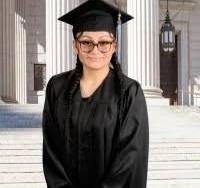

##### Mariah GALINDO

Marxe Assistant/ MIA Student, CUNY Baruch College

##### Gang HE

Associate Professor, CUNY Baruch College

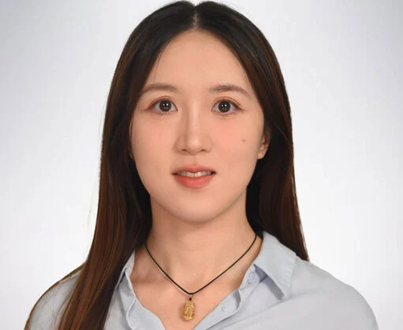

##### Kaifang LUO

Postdoctoral Researcher, CUNY Baruch College

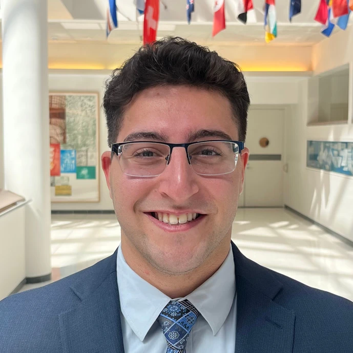

##### Daniel YADGAROV

Macaulay Honors Student, CUNY Baruch College

##### Yahao ZHANG

Incoming Visiting Student/Ph.D. Candidate, Wuhan University

## Alumni

|  | Name | Role/Affiliation | Started | Ended |
|----|----|----|----|----|
| 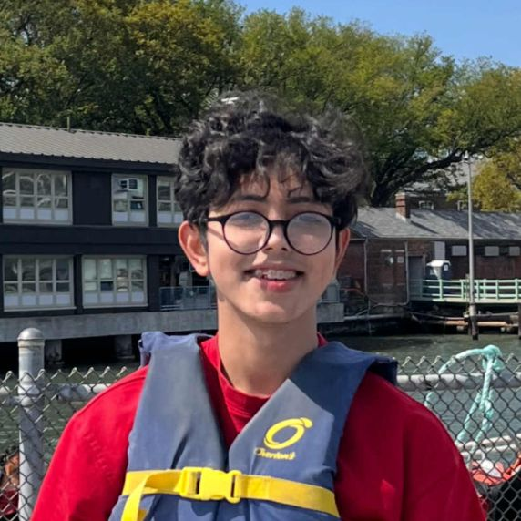 | [Samid RAHMAN](https://www.linkedin.com/in/samid-sadeem-033b74306/) | CUNY Undergraduate Climate Scholar, Manhattan Community College | 2025-09 | 2025-12 |
|  | Samuel LEE | Research Assistant/Friends Seminary | 2025-08 | 2025-12 |
| 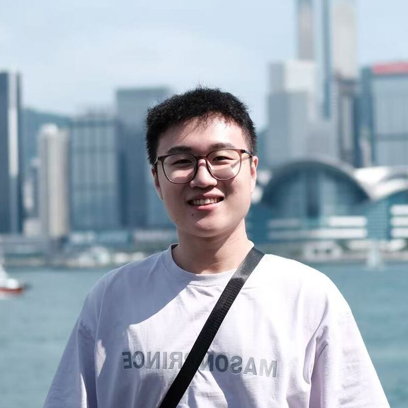 | [Xinyang CHE](https://xinyang-che.github.io) | Research Assistant/ M.S., Xi’an Jiaotong University | 2025-06 | 2025-12 |
| 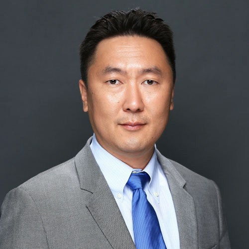 | [Jun-Ki CHOI](https://udayton.edu/directory/engineering/mechanical-and-aerospace/choi_jun-ki.php) | Anderson Endowed Chair Professor, University of Dayton | 2025-05 | 2025-09 |
| 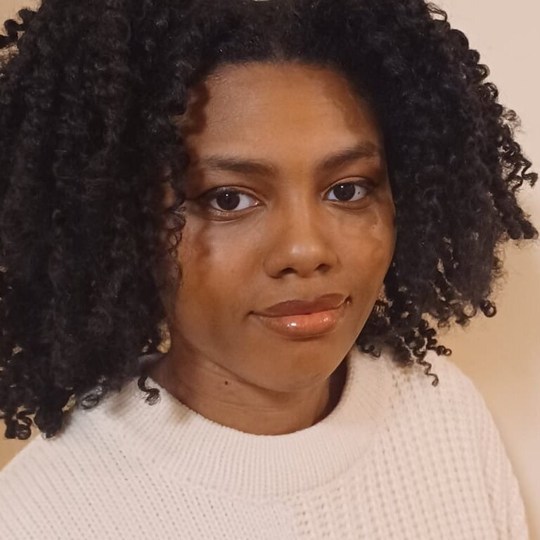 | [Arielle CANATE](https://www.linkedin.com/in/arielle-ca%C3%B1ate/) | QMSS Master’s Student, CUNY Graduate Center | 2024-12 | 2025-08 |
| 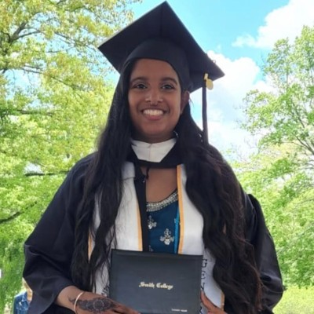 | [Tiffany HUGH](https://www.linkedin.com/in/tiffany-hugh-90878b237) | QMSS Master’s Student, CUNY Graduate Center | 2024-12 | 2025-08 |
|  | [Wenge RAO](https://giselle1119.github.io/) | Visiting Student/Ph.D. Candidate, Peking University | 2024-12 | 2025-06 |
| 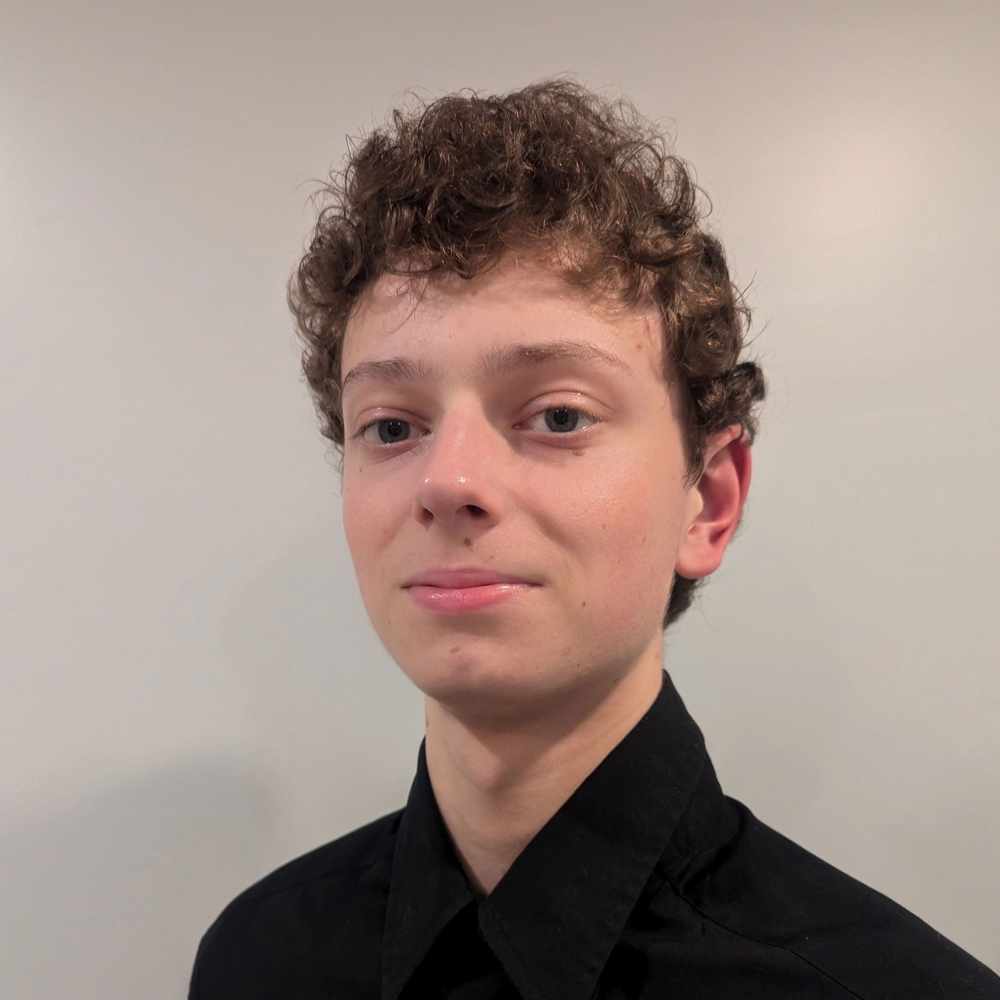 | Oliver NIEDBALA | Student, Saint Francis Preparatory School | 2024-11 | 2025-05 |
| 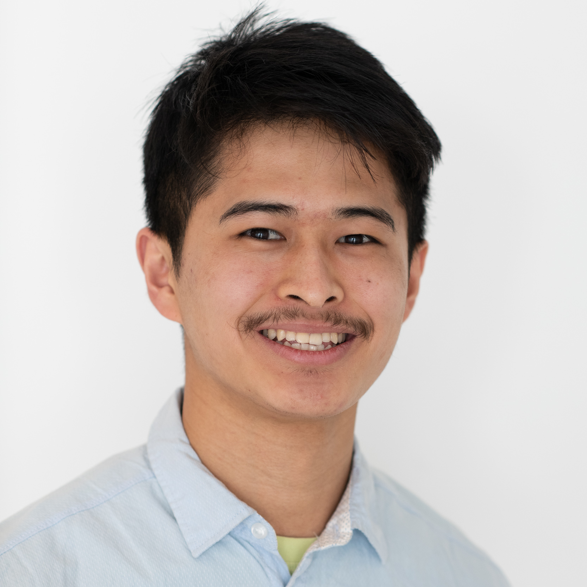 | [Tenzin SINON](https://www.linkedin.com/in/10sinon/) | CUNY Undergraduate Climate Scholar, Hunter College | 2024-09 | 2024-12 |
| 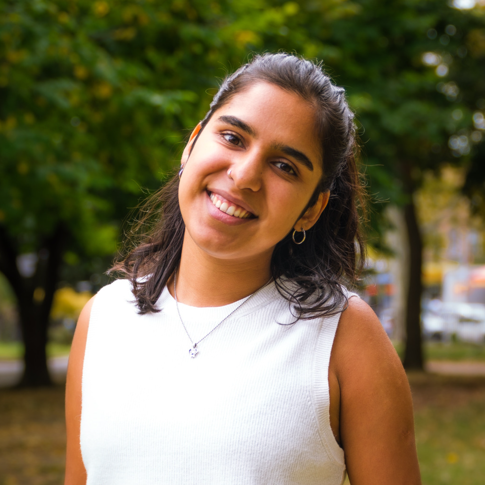 | [Tamara VALDERRAMA](https://cl.linkedin.com/in/tamara-valderrama-242289207) | CUNY Undergraduate Climate Scholar, City College | 2024-09 | 2024-12 |
| 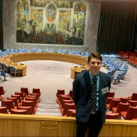 | [Nicolo ANTONUCCI](https://www.linkedin.com/in/nicolo-antonucci-73a89a216) | Research Assistant/MIA Student, CUNY Baruch College | 2023-09 | 2023-12 |
| 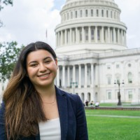 | [Kately ARRIAGE](https://www.linkedin.com/in/kately-arriaga?trk=public_profile_browsemap-profile) | Research Assistant/MPA Student, CUNY Baruch College | 2023-09 | 2023-12 |
|  | [Yun LI](https://www.linkedin.com/in/yun-li-0b96041b2/) | Research Assistant/M.S., KU Leuven | 2023-07 | 2024-08 |
