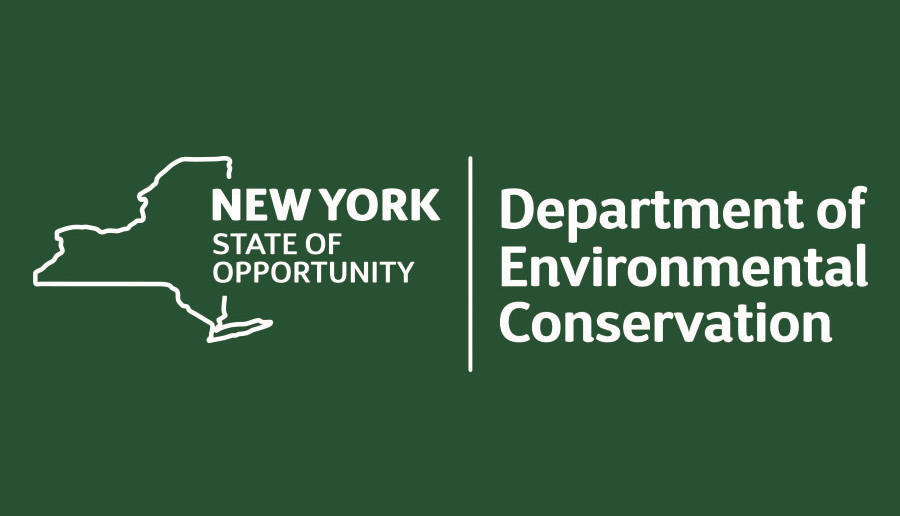

# Projects

Funded projects

|  | Title | Team | Funder | Description | Funding | Start | End |
|----|----|----|----|----|----|----|----|
|  | [Made in America: Unpacking the Drivers and Impacts of Domestic Clean Energy Manufacturing](https://madeinamerica.netlify.app) | Gang He, Kaifang Luo, Michael Davidson, Ahmad Lashkaripour, Ilaria Mazzocco, Minghao Qiu | Alfred P. Sloan Foundation | To undertake an interdisciplinary research project studying the drivers and impacts of domestic clean energy manufacturing interventions, resulting from an Open Call on Energy System Interactions in the United States | \$750,000 | 2025 | 2028 |
|  | [Global Clean Energy Supply Chains Analysis and Power Systems Resources Adequacy Assessment](https://ccci.berkeley.edu/research) | Gang He | University of California, Berkeley | The goal of this project is to collaborate with CCCI team to study global clean energy supply chains and power system resources adequacy. | \$100,000 | 2024 | 2026 |
|  | [Exploring Energy Burden Among the Older Adults and People with Disabilities in New York City Public Housing Communities](projects/2024-ssa-energy-burden-older-adults-people-with-disabilities-nyc.llms.md) | Gang He, Kaifang Luo, Hilary Botein, Frank Heiland, Anna D’Souza | Social Security Administration | The goal of this project is to investigate the energy burden faced by older adults (ages 62 and older) and people with disabilities in New York City to better understand its impact on their wellbeing. | \$100,000 | 2024 | 2025 |
|  | [Power system beyond coal](https://emp.lbl.gov/) | Gang He | University of California, Berkeley | The goal of this project is to collaborate with LBL team in modeling the decarbonization of China’s power sector. | \$64,000 | 2024 | 2025 |
|  | [The carbon mitigation, air quality, and human health benefits achieved by global solar PV supply chains](https://www.climateworks.org/grants-database/?sort_by=newest&search=City%20University%20of%20New%20York&posts_per_page=20) | Gang He | ClimateWorks Foundation | The goal of this project is to investigate the air quality and human health benefits achieved by global solar PV supply chains. | \$100,000 | 2023 | 2025 |
|  | [Multi-Country Electricity Transition Potential and Challenges Project (MCET)](https://www.edf.org/work/economics-energy-transition) | Gang He | Environmental Defense Fund | The goal of this project is to provide technical support to the MCET team to assess the opportunities and barriers to decarbonize their electricity sectors using open data and models. | \$40,000 | 2023 | 2024 |
|  | [New York State Solid Waste Characterization](https://news.stonybrook.edu/environmental-stewardship/stony-brook-receives-4-25m-grant-from-state-to-help-ny-improve-recycling/) | David Tonjes, Elizabeth Hewitt, Gang He | New York State Department of Environmental Conservation | This project will sample a set of municipal waste systems statewide to determine the composition of managed wastes and recyclables. | \$4,355,776 (\$200,000) | 2020 | 2025 |
|  | [Workshop on Data Science Across the Undergraduate Curriculum: University-Industry Online Case Studies on Applications of Data Science](https://www.nsf.gov/awardsearch/showAward?AWD_ID=1912159) | David Furguson, Gang He, Thomas Woodson, Marianna Savoca, Elizabeth Hewitt | National Science Foundation | This project supported the national workshop entitled ‘[Data Science Across the Undergraduate Curriculum: University-Industry Online Case Studies on Applications of Data Science](https://sites.google.com/view/nsf-data-science-workshop/)’. | \$49,796 | 2019 | 2020 |
|  | [Power Systems Modeling and Analysis](https://energy.lbl.gov/people/gang-he) | Gang He | Lawrence Berkeley National Laboratory | Multiple projects to collaborate with LBL team modeling the technology and policy options of decarbonizing China’s power systems. | \$140,000 | 2018 | 2024 |
|  | [Jobs and economic impact of offshore wind development](https://deeppolicylab.github.io/research/new-york-climate-initiative/index.html) | Gang He | Leading Offshore Wind Developer | This project studies the jobs and economic impact of offshore wind development in New York State. | \$30,000 | 2018 | 2019 |
