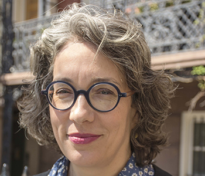
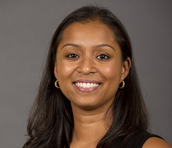

# Exploring Energy Burden Among the Older Adults and People with Disabilities in New York City Public Housing Communities

The goal of this project is to investigate the energy burden faced by older adults (ages 62 and older) and people with disabilities in New York City to better understand its impact on their well-being.

Published

November 1, 2024

## PI Team

##### Gang HE

Assistant Professor, CUNY Baruch College

##### Kaifang LUO

Postdoctoral Researcher, CUNY Baruch College

##### Hilary BOTEIN

Associate Professor, CUNY Baruch College

##### Frank HEILAND

Professor, CUNY Baruch College

##### Anna D’SOUZA

Associate Professor, CUNY Baruch College

## Research Assistants

##### Mariah GALINDO

Marxe Assistant/ MIA Student, CUNY Baruch College

##### Arielle CANATE

QMSS Master’s Student, CUNY Graduate Center

##### Tiffany HUGH

QMSS Master’s Student, CUNY Graduate Center

## Summary

The goal of this proposal is to investigate the energy burden faced by older adults (ages 62 and older) and people with disabilities in New York City to better understand its impact on their well-being. Energy burden, characterized by more than 6% of household disposable income allocated to energy expenses, affects socio-economically vulnerable populations, particularly older adults and people with disabilities who often rely on fixed incomes from Social Security. These individuals are sensitive to temperature changes and thus to rising heating and cooling costs and tend to have heightened dependence on energy-consuming medical devices. Our mixed-methods approach involves selecting 10 public housing developments in NYC, facilitating targeted outreach to survey 100 individuals who are older adults and people with disabilities, receive social security benefits and diverse in race, ethnicity, and sex. We will then conduct in-depth interviews with 10 older adults and 10 people with disabilities from this surveyed group. Our quantitative analysis will offer a broad perspective, examining the impact of factors like inflation on energy burden, while the qualitative component will provide insights into lived experiences and coping strategies, particularly regarding expenses related to cooling and use of medical devices. The study will provide new insights and data for Social Security policymakers and researchers seeking to understand the energy needs and burden of older adults and people with disabilities living on fixed incomes. Our study of energy burden in NYC public housing communities directly speaks to the economic insecurities and service needs of low-income urban Social Security beneficiaries, a large, diverse, and traditionally underserved population. The findings will help identify beneficiaries likely to face energy burden and develop policies to assist them, thereby improving their well-being and the systemic equity in NYC and beyond.

Source: [NYRDRC Research Library 25-08](https://www.nyrdrc.org/research-library/ny25-02-estimating-what-we-miss-about-direct-care-workers-employment-earnings-and-retirement-savingsnbsp-7dlrr-dcfy8-zye4b-nt2en-blr3c)

## Acknowledgment

We are grateful for the support and collaboration from the NYCHA team. We thank Jennifer Laird for her insights and advice on our survey and interview instruments. The proposal benefited from discussions with Deborah Balk and Na Yin at early stage. We thank Neil Bennett for reviewing our draft and providing helpful comments to strengthen our proposal.

## About NYRDRC

> The [New York Retirement and Disability Research Center (NYRDRC)](https://www.nyrdrc.org/) brings together the CUNY Institute for Demographic Research, the CUNY Brookdale Center for Healthy Aging, and The New School’s Schwartz Center for Economic Policy Analysis to illuminate the multifaceted challenges facing older adults and people with disabilities, caused by the political economy, geographical divides, the changing workplace, and climate instability. NYRDRC is one of six centers funded by a cooperative agreement with the Social Security Administration as part of its [Retirement and Disability Research Consortium (RDRC)](https://www.ssa.gov/policy/extramural/index.html).

Note: This project was awarded by the Social Security Administration then canceled by the Trump Administration.
