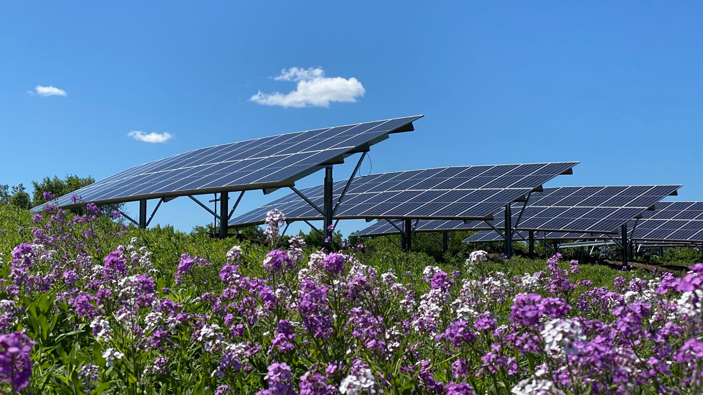
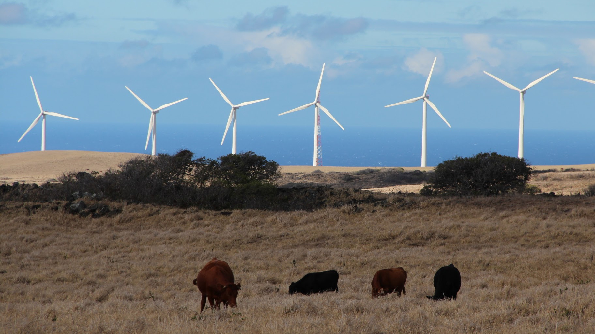
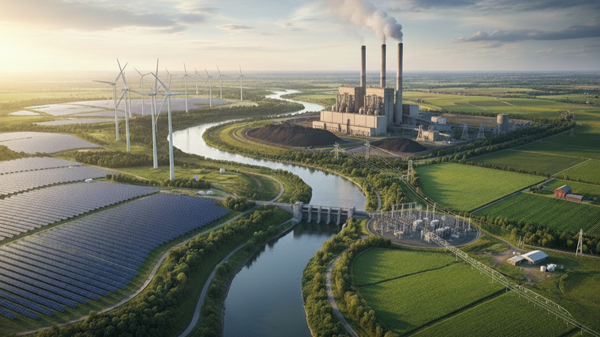
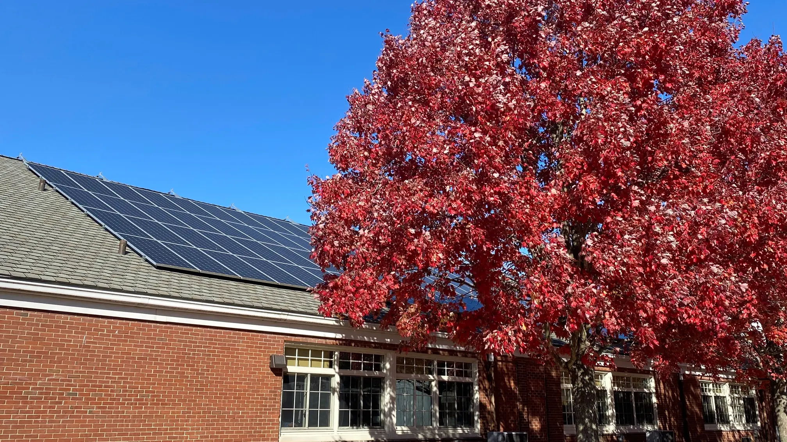
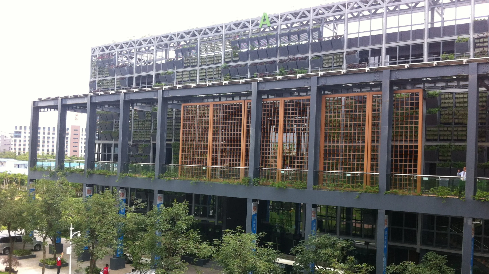
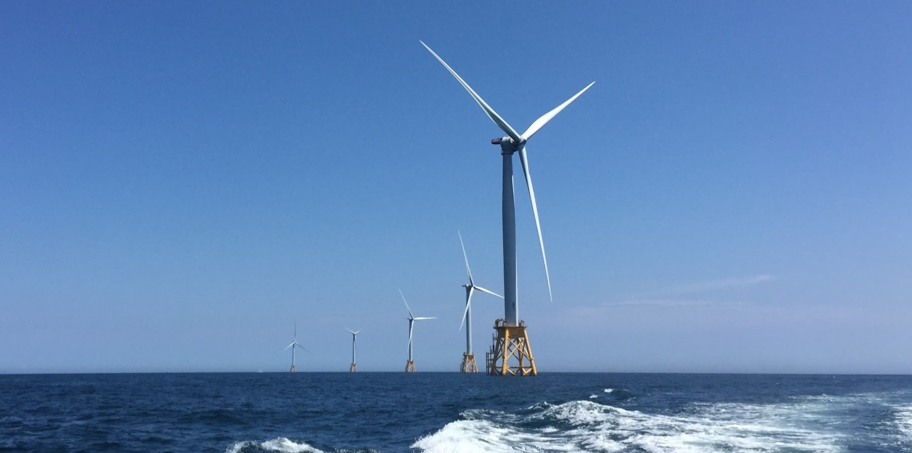
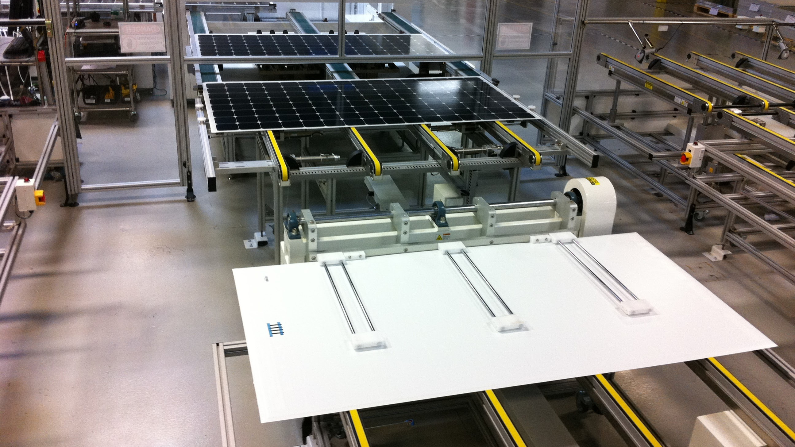

# Research & Initiatives

What we do

## Research

##### Clean Energy Supply Chains

Ensuring sustainable, resilient, and just global clean energy supply chains to achieve climate goals.

##### Power Systems Decarbonization

Exploring the pathways, technology, market, impacts, and implications of clean power transition

##### Climate Impacts on Energy Systems

Enhancing the adaptation of energy systems to climate change.

##### Energy Nexus Research

Exploring the complex nexus of energy, water, carbon, and integrated natural and social systems.

##### Energy and Climate Justice

Ensuring a just clean energy transition.

## Initiatives

##### China Carbon Neutrality Initiative

Facilitating the transition to a low-carbon economy in China.

##### New York Climate Initiative

Facilitating the implementation of the New York State Climate Action Plan.

##### United States Clean Energy Initiative

Exploring clean energy manufacturing and transition in the United States.
