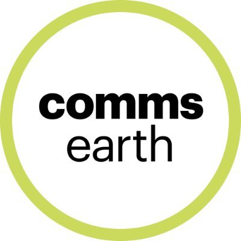
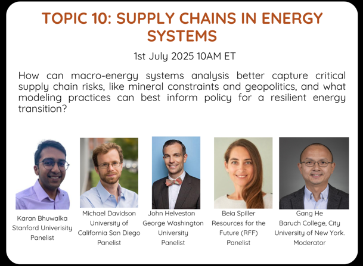
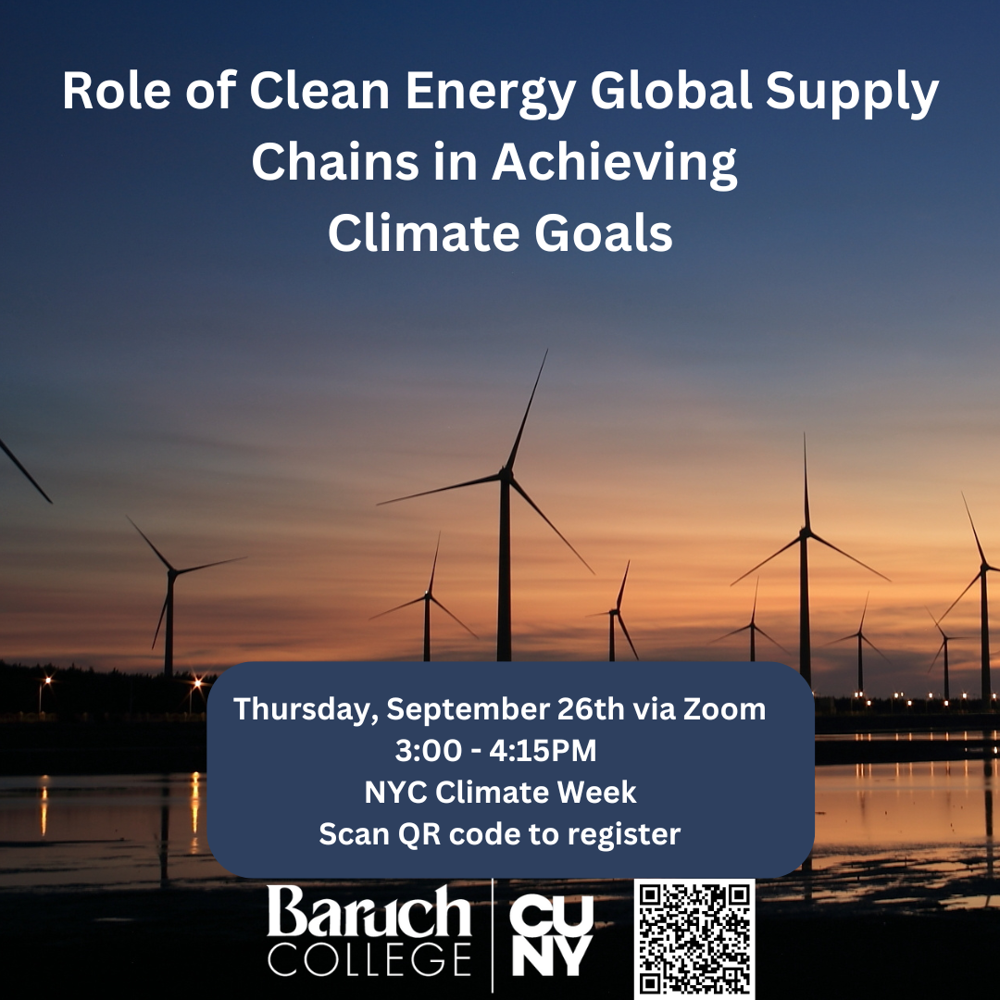
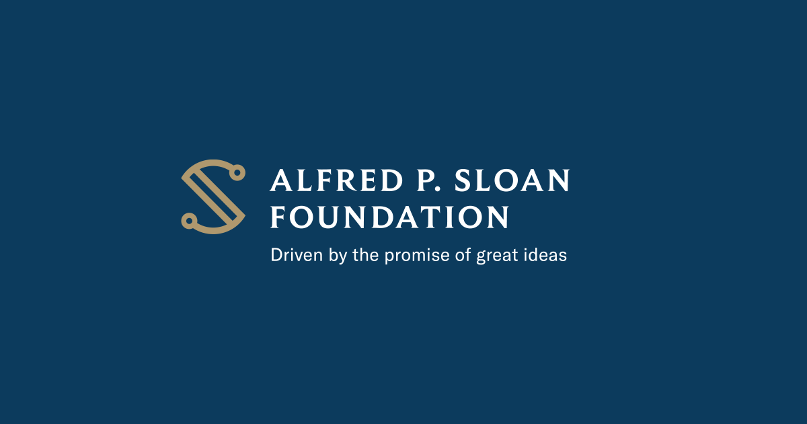
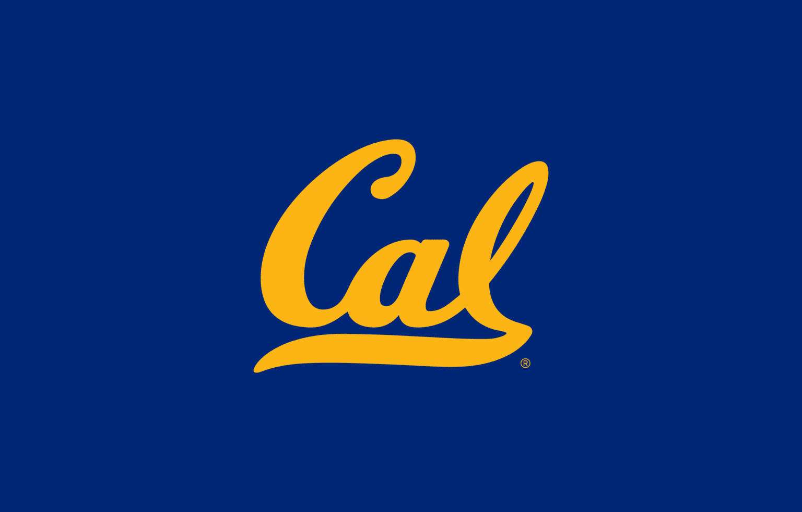

# Clean Energy Supply Chains

Ensuring sustainable, resilient, and just global clean energy supply chains to achieve climate goals.

A solar farm in New York, Photo by Gang He

## Overview

Global clean energy supply chains stand at a critical intersection of integration and decoupling. This research theme studies the benefits, costs, and risks of clean energy global supply chains to inform international and domestic climate policies to enable sustainable, rapid, and just energy transitions to achieve climate goals.

## Featured publications

##### Imported solar photovoltaics contributed to health and climate benefits in the United States

*One Earth*

Imported solar panels prevented nearly 600 premature deaths and delivered \$28 billion in climate and health benefits to the United States.

Oct 8, 2025

##### Can China break the ‘cost curse’ of nuclear power?

*Nature*

Strengthening regulations and domestic supply chains could be key to making nuclear power more economically viable.

Jul 31, 2025

##### Advancing a just, resilient, and sustainable clean energy supply chain

*ClimateWorks Blog*

In addressing the challenges and maximizing the benefits, there is a pressing need for a commonly agreed framework for a just, resilient, and sustainable clean energy supply…

Dec 5, 2023

##### Deploying solar photovoltaic energy first in carbon-intensive regions brings gigatons more carbon mitigations to 2060

*Communications Earth & Environment*

A net GHG mitigation of 1.29 Gt CO2-equivalent from 2009–2019, achieved by 1.97 Gt of mitigation from installation minus 0.68 Gt of emissions from manufacturing.

Oct 11, 2023

[More Publications »](../../more-publications.llms.md#category=supply-chain)

## Featured events

##### Macro-Energy Systems Speaker Series: Supply Chains in Energy Systems

Join us to discuss how macro-energy systems analysis can better capture critical supply chain risks.

Jul 1, 2025

##### Climate Week NYC 2024: Clean Energy Global Supply Chains Panel

Join us to discuss Role of Clean Energy Global Supply Chains in Achieving Climate Goals during Climate Week NYC 2024.

Sep 26, 2024

[More Events »](../../more-events.llms.md#category=supply-chain)

## Featured projects

##### Made in America: Unpacking the Drivers and Impacts of Domestic Clean Energy Manufacturing

Alfred P. Sloan Foundation

To undertake an interdisciplinary research project studying the drivers and impacts of domestic clean energy manufacturing interventions, resulting from an Open Call on…

##### Global Clean Energy Supply Chains Analysis and Power Systems Resources Adequacy Assessment

University of California, Berkeley

The goal of this project is to collaborate with CCCI team to study global clean energy supply chains and power system resources adequacy.

[More Projects »](../../projects.llms.md)
