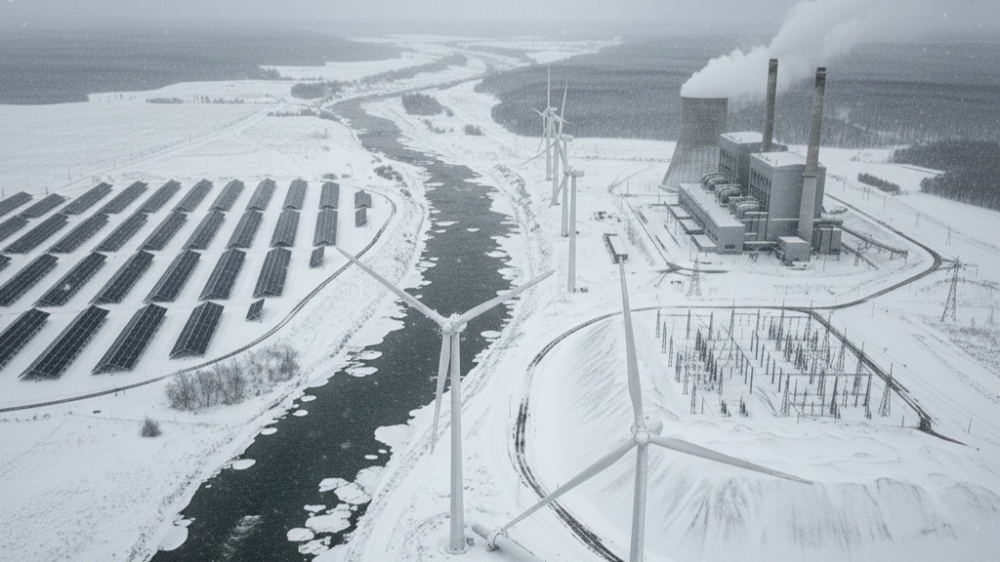
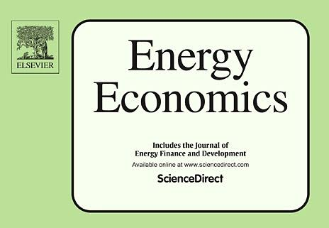

# Climate Impacts on Energy Systems

Enhancing the adaptation of energy systems to climate change.

AI generated image using Gemini

## Overview

Climate change poses growing risks and challenges to energy systems. This research theme assesses the impacts and informs strategies for mitigation, adaptation, and resilience-building to ensure reliable and sustainable energy systems in the future.

## Featured publications

##### Resilience planning for power systems under deep climate uncertainty

*Energy Economics*

A hybrid framework combining a Graph Neural Network and a Conditional Generative Adversarial Network (GNN-cGAN) is utilized to capture the spatiotemporal couplings of…

Sep 1, 2026

##### Climate change impacts on planned supply–demand match in global wind and solar energy systems

*Nature Energy*

Up to 32% or 44% of non-Antarctic land areas for wind or solar, respectively, are projected to experience supply demand match reductions by the end of this century under an…

Jul 24, 2023
