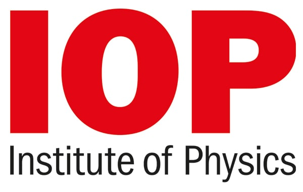
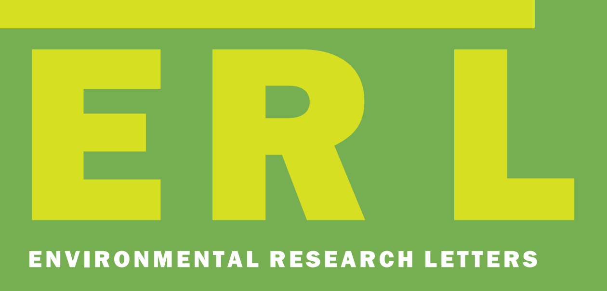
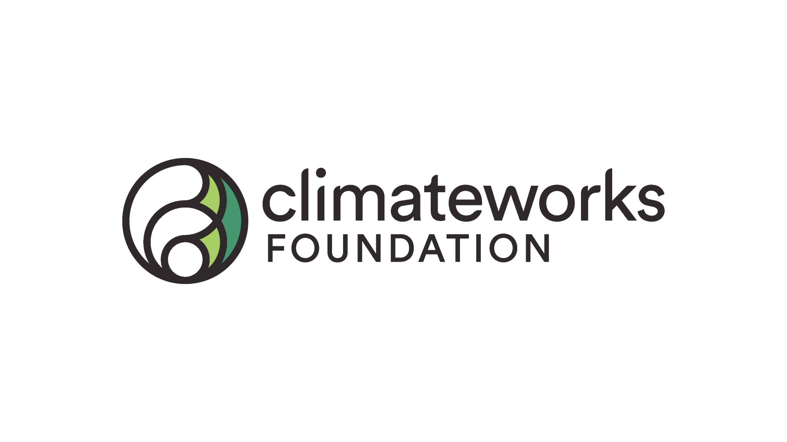

# Energy Nexus Research

Exploring the complex nexus of energy, water, carbon, and integrated natural and social systems.

AI generated image using Gemini

## Overview

This research theme focuses on understanding how energy nexus systems interact and influence each other within the broader context of resource management, sustainable development, climate change, and human well-being. This nexus approach recognizes that decisions in one domain (e.g., energy production) have cascading effects on others (e.g., water resources, carbon emissions, air pollution, human health, and social systems).

## Featured publications

##### Imported solar photovoltaics contributed to health and climate benefits in the United States

*One Earth*

Imported solar panels prevented nearly 600 premature deaths and delivered \$28 billion in climate and health benefits to the United States.

Oct 8, 2025

##### Regional disparities in health and employment outcomes of China’s transition to a low-carbon electricity system

*Environmental Research: Energy*

Although disparities in health impacts across provinces narrow as fossil fuels phase out, disparities in labor compensation widen with wealthier East Coast provinces gaining…

Apr 22, 2024

##### Accelerating China’s power sector decarbonization can save lives: integrating public health goals into power sector planning decisions

*Environmental Research Letters*

The value of climate and health benefits would exceed the additional costs, leading to \$824 billion net benefits from 2021 to 2050.

Sep 25, 2023

##### Global assessment of the carbon–water tradeoff of dry cooling for thermal power generation

*Nature Water*

We build a global unit-level framework to investigate the CO2 emission and energy penalty due to the deployment of dry cooling.

Aug 7, 2023

[More Publications »](../../more-publications.llms.md#category=energy-nexus)

## Featured projects

##### The carbon mitigation, air quality, and human health benefits achieved by global solar PV supply chains

ClimateWorks Foundation

The goal of this project is to investigate the air quality and human health benefits achieved by global solar PV supply chains.
