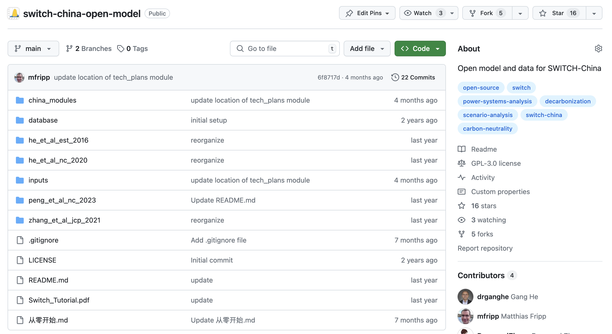
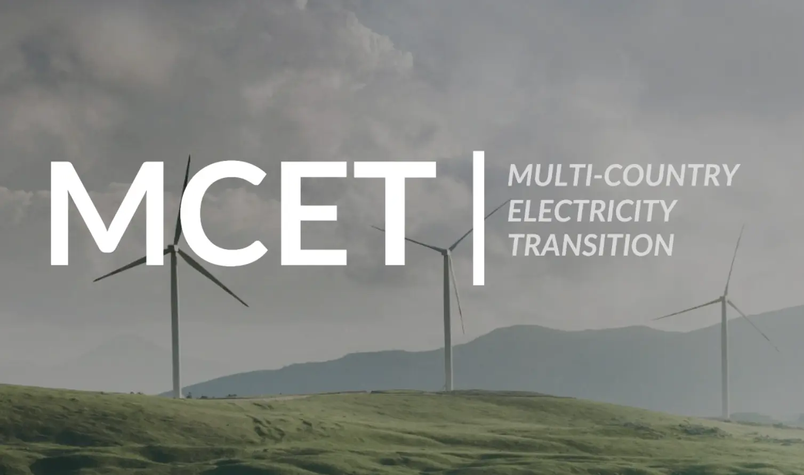

# Power Systems Decarbonization

Exploring the pathways, technology, market, impacts, and implications of clean power transition

Pakini Nui Wind Farm in Hawaii, Photo by Gang He

## Overview

“Electrifying energy and decarbonizing electricity” is at the heart of the global energy transition. This research theme focuses on transforming the energy landscape by increasing electrification in various sectors, such as transportation, buildings, and industry, while simultaneously decarbonizing the electricity supply. The goal is to explore the pathways to net-zero-emissions power systems and their environmental, climate, human health, and socio-economic implications.

## Featured publications

##### Resilience planning for power systems under deep climate uncertainty

*Energy Economics*

A hybrid framework combining a Graph Neural Network and a Conditional Generative Adversarial Network (GNN-cGAN) is utilized to capture the spatiotemporal couplings of…

Sep 1, 2026

##### Aligning offshore wind deployment with local priorities to accelerate power system decarbonization

*Communications Earth & Environment*

Offshore wind can bolster the energy self-sufficiency of coastal provinces, shifting them from net electricity importers to exporters. It also reduces the need for energy…

Apr 21, 2026

##### Emission trading scheme reshapes the decarbonisation pathways of China’s power sector

*Applied Energy*

Integrating the SWITCH-China capacity expansion model with a carbon trading module, we evaluate the potential carbon profits and costs of currently operating ETS-regulated…

Mar 21, 2026

##### Renewable integration and AI demand reshaped power grids in 2025

*Nature Reviews Clean Technology*

The importance of renewable integration into grids came to the forefront in 2025. New challenges in stability, storage, artificial intelligence demand and policy changes…

Jan 20, 2026

[More Publications »](../../more-publications.llms.md#category=power-system)

## Featured resources

##### SWITCH-China Open Model

SWITCH-China: open source model for the world’s largest power system. Open data on power plants, transmission, costs, and demand by province.

Jun 1, 2022

##### Multi-Country Electricity Transition (MCET) Network

This global alliance of energy modelers, policymakers, and advocates leverages advanced, open-source energy planning tools to identify the best pathways, costs, and…

Jan 1, 2022

[More Resources »](../../resources.llms.md)

## Featured events

##### Climate Week NYC 2025: The Role of Nuclear Energy in Decarbonization and Powering the AI Era

Join us to discuss the role of nuclear energy in decarbonization and powering the AI era during Climate Week NYC 2025.

Sep 23, 2025

##### 2025 Workshop on Open Modeling Carbon Neutrality of the Power Sector

The second workshop on open modeling carbon neutrality of the power sector is held at Xi’an Jiaotong University in China.

Jun 20, 2025

[More Events »](../../more-events.llms.md#category=power-system)

## Featured projects

##### Global Clean Energy Supply Chains Analysis and Power Systems Resources Adequacy Assessment

University of California, Berkeley

The goal of this project is to collaborate with CCCI team to study global clean energy supply chains and power system resources adequacy.

##### Power system beyond coal

University of California, Berkeley

The goal of this project is to collaborate with LBL team in modeling the decarbonization of China’s power sector.

##### Multi-Country Electricity Transition Potential and Challenges Project (MCET)

Environmental Defense Fund

The goal of this project is to provide technical support to the MCET team to assess the opportunities and barriers to decarbonize their electricity sectors using open data…

##### Power Systems Modeling and Analysis

Lawrence Berkeley National Laboratory

Multiple projects to collaborate with LBL team modeling the technology and policy options of decarbonizing China’s power systems.

[More Projects »](../../projects.llms.md)
