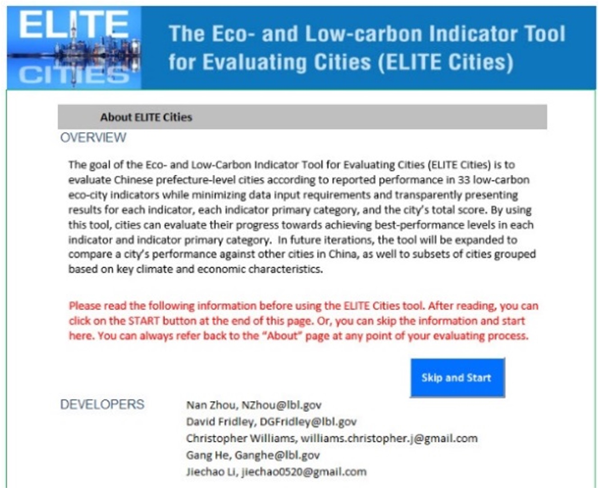
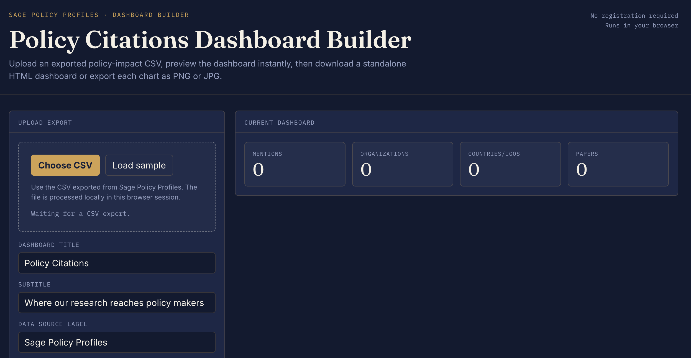
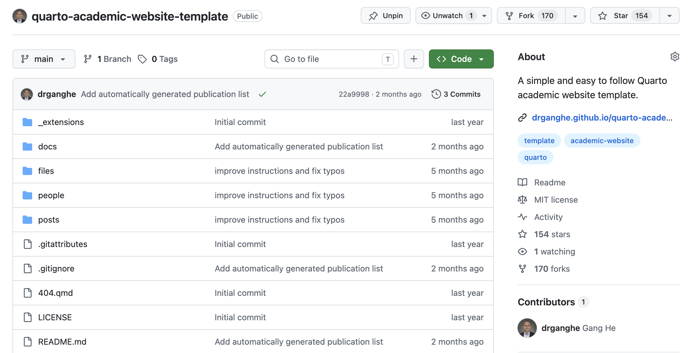

# Resources

Models, data, open courses, and other resources

## Models & Data

##### SWITCH-China Open Model

SWITCH-China: open source model for the world’s largest power system. Open data on power plants, transmission, costs, and demand by province.

Jun 1, 2022

##### Eco and Low-Carbon Indicator Tool for Evaluating Cities (ELITE Cities)

An Excel-based tool for low-carbon city development with key indicators, benchmarks, and measurement methods.

May 8, 2016

## Open Courses

##### Energy and Climate Policy

This graduate-level course provides a systems approach to understanding the essential policy questions and analytic tools necessary to achieve the energy transition required…

##### Energy, Climate, and Society

This undergraduate course offers a comprehensive and interdisciplinary approach to understanding the science behind climate change, the complex technological and policy…

##### Climate Guest Speakers

We’re seeking guest speakers who are passionate about sharing their experiences and inspiring the next generation of climate leaders.

## Tools

##### Policy Citations Dashboard Builder

Create a dashboard for visualizing your policy citations and impact using Sage Policy Profiles data.

Jul 6, 2026

##### Quarto Academic Website Template

A Quarto template for academic websites.

Oct 15, 2024
