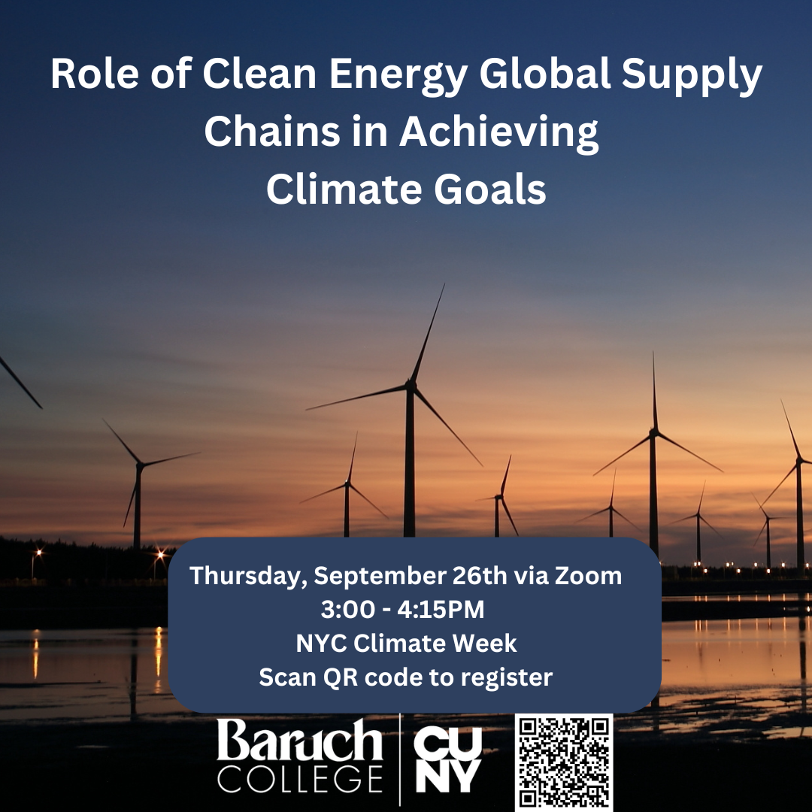

## Title

Role of Clean Energy Global Supply Chains in Achieving Climate Goals

### Time

Thursday, September 26, 3:00PM - 4:15PM

### Venue 
Online via zoom. Please register [here](https://baruch.zoom.us/meeting/register/tZApd-ivqzIiGt1Ch39rPPC_m1T8Sk9mlVy-#/registration).

## About
Global clean energy supply chains stand at a critical intersection of integration and decoupling. The panel will discuss the evolving landscape, benefits and challenges, and future directions of clean energy global supply chains, to meet climate goals while addressing growing international and domestic concerns. 

## Moderator

:::{#moderator}
:::

## Panelists

:::{#panelists}
:::

## References

- @helveston_he_davidson_2022 
- @chen2023deploying 
- @davidson2022risks 
- @helveston2019china 