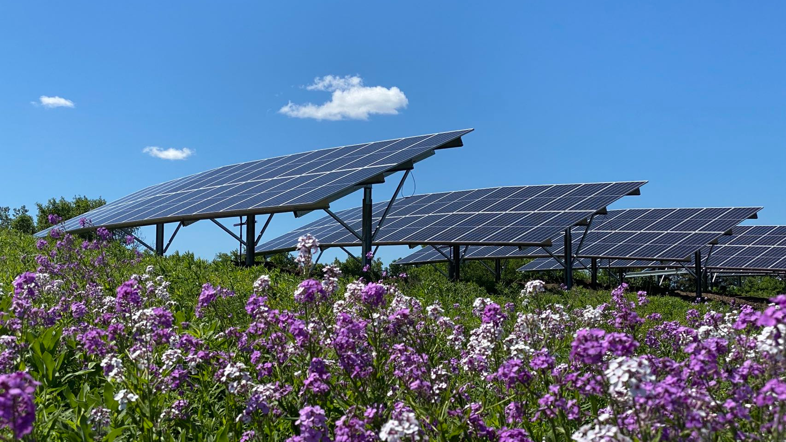

## Overview

This research theme aims at evidence-based analysis to understand the importance of a sustainable and resilient clean energy global supply chains to achieve climate goals. We evaluate the economic costs, carbon mitigation, air quality, and human health benefits achieved by global clean energy supply chains. 

## Featured publications

John Helveston, **Gang He**\*, and Michael Davidson. 2022. [Quantifying the Cost Savings of Global Solar Photovoltaic Supply Chains](https://www.nature.com/articles/s41586-022-05316-6). *Nature* 612: 83–87. doi: [10.1038/s41586-022-05316-6](https://doi.org/10.1038/s41586-022-05316-6). \[[pdf](https://drganghe.github.io/files/papers/2022-nature-solar-supply-chains-preprint.pdf)\]

<!--Include social share buttons-->


