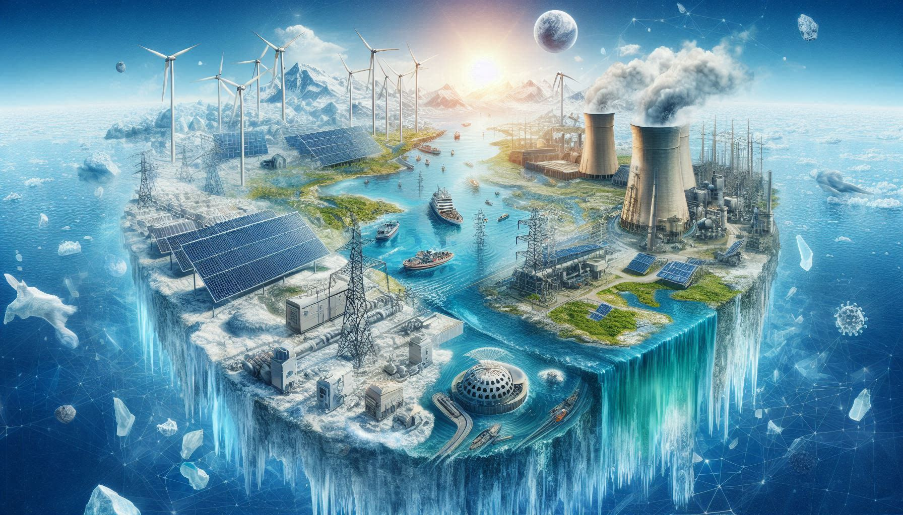

## Overview

Climate change poses growing risks and challenges to energy systems. This research theme assesses the impact and informs strategies for mitigation, adaptation, and resilience-building to ensure reliable and sustainable energy systems in the future. 

## Featured publications

:::{#featured-publications}
:::

<!--Include social share buttons-->


