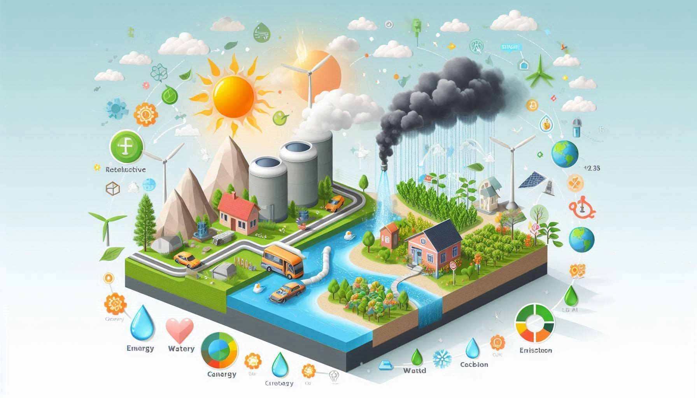

## Overview

Understanding how energy nexus systems interact and influence each other within the broader context of resource management, sustainable development, climate change, and human well-being. This nexus approach recognizes that decisions in one domain (e.g., energy production) have cascading effects on others (e.g., water resources, carbon emissions, and social systems).  

## Featured publications

:::{#featured-publications}
:::

<!--Include social share buttons-->


