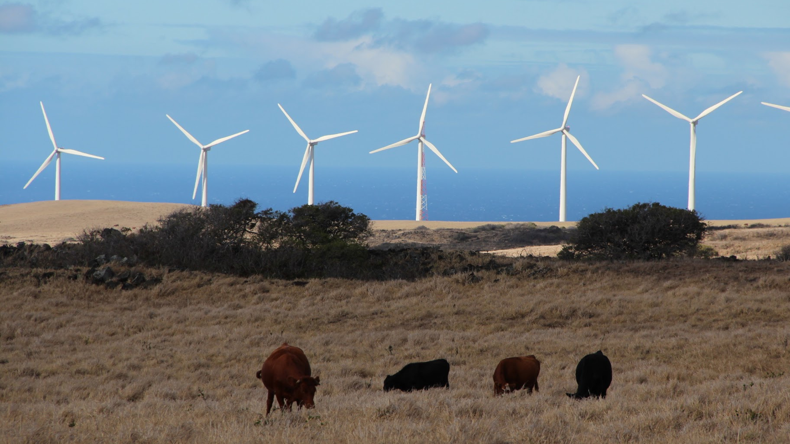

## Overview

Electrifying energy, and decarbonizing electricity. Power system is at the center of global energy transtion. This research theme explores the pathways and their environmental, climate, human health, and socio-economic implications.

## Featured publications

**He, Gang**\*, Jiang Lin\*, Froylan Sifuentes, Xu Liu, Nikit Abhyankar, and Amol Phadke\*. 2020. [Rapid Cost Decrease of Renewables and Storage Accelerates the Decarbonization of China's Power System](https://www.nature.com/articles/s41467-020-16184-x). *Nature Communications* 11 (1): 2486. doi: [10.1038/s41467-020-16184-x](https://doi.org/10.1038/s41467-020-16184-x). \[[pdf](https://www.nature.com/articles/s41467-020-16184-x.pdf)\]

Lin, Jiang\*, Nikit Abhyankar, **Gang He**, Xu Liu, and Shengfei Yin. 2022. [Large Balancing Areas and Dispersed Renewable Investment Enhances Grid Flexibility in a Renewable-Dominant Power System in China](https://www.cell.com/iscience/fulltext/S2589-0042(22)00019-0). *iScience* 25(2): 103749. doi: [10.1016/j.isci.2022.103749](https://doi.org/10.1016/j.isci.2022.103749). \[[pdf](https://www.cell.com/action/showPdf?pii=S2589-0042%2822%2900019-0)\] 

Li, Bo, Minyou Chen\*, Ziming Ma, **Gang He**, Wei Dai, Dongran Liu, Chi Zhang, and Haiwang Zhong. 2022. [Modelling Integrated Power and Transportation Sectors Decarbonization with Hydrogen Energy
Storage](https://ieeexplore.ieee.org/document/9555251). *IEEE Transactions on Industry Applications* 58(2): 2677--2693. doi: [10.1109/TIA.2021.3116916](https://doi.org/10.1109/TIA.2021.3116916). [[pdf](https://drganghe.github.io/files/papers/2022-IEEE-ModelingIntegratedPowerAndTransportationSystems.pdf)\] 

**He, Gang**\*, Anne-Perrine Avrin, James H. Nelson, Josiah Johnston, Ana Mileva, Jianwei Tian, and Daniel M. Kammen\*. 2016. [SWITCH-China:A Systems Approach to Decarbonizing China's Power System](http://pubs.acs.org/doi/abs/10.1021/acs.est.6b01345). *Environmental Science and Technology* 50(11): 5467--5473. doi: [10.1021/acs.est.6b01345](http://dx.doi.org/10.1021/acs.est.6b01345). \[[pdf](https://drganghe.github.io/files/papers/2016-EST-SWITCH-China.pdf)\]

<!--Include social share buttons-->


